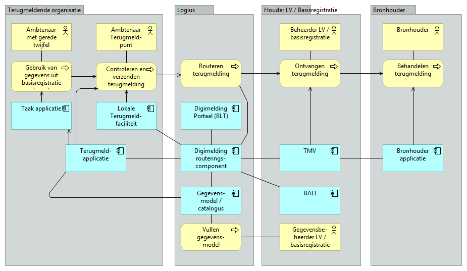

# Functionaliteit op hoofdlijnen en architectuur

Deze specificatie geeft een technische en functionele beschrijving van
een aantal services voor het uitwisselen van informatie tussen
terugmeldapplicaties, Digimelding Webservice en landelijke voorzieningen
van basisregistraties

De beschreven services zorgen ervoor dat de informatie op een standaard
manier wordt uitgewisseld.

In de volgende paragraaf wordt ingegaan op hoe de services zich
verhouden tot de NORA-informatiearchitectuur en welke standaarden worden
gebruikt. Vervolgens wordt dieper ingegaan op de functionaliteit die
deze services moeten bieden.

# Referentiearchitectuur

In deze specificatie wordt uitgegaan van een referentiearchitectuur.

{width="5.986629483814523in"
height="3.164179790026247in"}

In figuur 1 is de referentie-applicatiearchitectuur weergegeven. Deze
gaat uit van een generiek overheidsperspectief, waarbij wordt
teruggemeld op meerdere basisregistraties en het dus handig is om
gebruik te maken van de routering door Digimelding Webservice. Het is
ook mogelijk om als afnemer direct aan te sluiten op de TMV van een
basisregistratie. De specificaties van de services in hoofdstuk 6 laten
beide varianten toe.

Aangaande deze catalogusvoorziening kunnen de verschillende catalogi ook
als bestanden beschikbaar gesteld worden aan de terugmeldende
organisaties voor implementaties in de eigen terugmeldapplicatie.

Aan deze specificatie wordt voldaan indien de in hoofdstuk 4 beschreven
services, voor zover deze relevant zijn voor de betreffende applicatie,
worden ondersteund.

Aanvullend geldt dat er een aantal implementatievarianten zijn.

  | Implementatievariant  | Specifieke en aanvullende eisen |
  | :-------------------  | :------------------------------ |
  | A1                    |  De terugmeldende ambtenaar maakt gebruik van het landelijke Digimelding Webservice portaal. |
  | A2                    |  De terugmeldende ambtenaar maakt gebruik van een lokaal binnen de organisatie geïnstalleerd terugmeldportaal welke middels webservices communiceert. |
  | A3                    |  De terugmeldende ambtenaar maakt gebruik van een terugmeldoptie binnen zijn taakapplicatie; de taakapplicatie zet deze terugmelding door naar een terugmeldapplicatie binnen de organisatie welke middels webservices communiceert. |
  | B1                    |  De communicatie middels webservices tussen terugmeldende organisatie en landelijke voorziening van een basisregistratie loopt via een webservices koppelvlak op de Digimelding Webservice, als landelijke voorziening. Deze landelijke voorziening verzorgt routering naar basisregistraties (en mogelijk protocoltransformatie naar een vorige of volgende versie van het koppelvlak). |
  | B2                    |  De communicatie middels webservices tussen terugmeldende organisatie en landelijke voorziening van een basisregistratie loopt rechtstreeks (staat niet geïllustreerd in referentieplaatje hierboven). |
