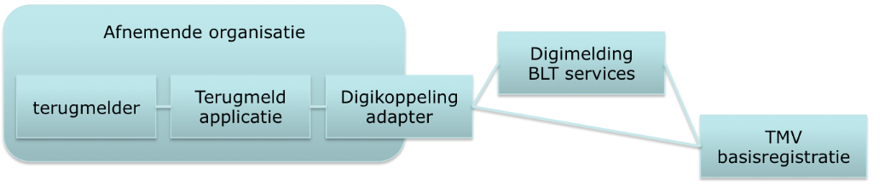

# Beveiliging, autorisatie en protocollen

## Authenticatie en autorisatie

Binnen de Digimelding-keten vindt op meerdere plaatsen authenticatie en
autorisatie plaats.

In deze sectie wordt uitgelegd welke verschillende middelen er zijn en
in welke stap ze gebruikt worden. Binnen Digimelding vinden
authenticatie en autorisatie plaats op transportniveau, applicatieniveau
en soms op persoonsniveau. Transport en logistiek gaan via de
Digikoppeling-standaarden.

Op applicatieniveau gaat het over de terugmeldapplicatie van de afnemer,
Digimelding Webservice en TMVs van basisregistraties.

Persoonsniveau komt voor bij Digimelding Portaal en mogelijkerwijs bij
nog te ontwikkelen andere oplossingen die gebruik maken van eHerkenning
of SSOn Rijk. Daarnaast kent een afnemende organisatie ook nog interne
authenticatie en autorisatie voor het verkrijgen van toegang door de
terugmelder tot de terugmeldapplicatie. Dit is buiten scope van deze
specificatie.

{width="4.715277777777778in"
height="1.0243055555555556in"}

+----------------+----------------+----------------+----------------+
| *              |                |                |                |
| *Autorisatie** |                |                |                |
+================+================+================+================+
| *              | **Terugmeld\   | **             | **TMV\         |
| *Terugmelder** | Applicatie**   | Digikoppeling\ | Basi           |
|                |                | Adapter**      | sregistratie** |
+----------------+----------------+----------------+----------------+
| \*             | \* OIN in DMKS | \* OIN in      | \* Transport   |
| E-herkenning\  | bericht        | Digikoppeling  | via            |
| in DMKS        |                |                |                |
| bericht        | \* (PKIO       | Headers        | Digikoppeling  |
|                | certificaat    | WS-Adressing   |                |
| \_ OIN         |                |                | \* Applicatie: |
|                | met OIN voor   | \* PKIO        |                |
| \_             | signing)       | certificaat    | via OIN in     |
| Vestigingsnr   |                |                | DMKS bericht   |
|                | \* OIN in      | met OIN voor   |                |
| \_             | Digikoppeling  | TLS/signing    | of             |
| Pers           |                |                |                |
| oonsaanduiding | Header         |                | via            |
|                | WS-security    |                | E-Herkenning : |
| \* SSOn Rijk   |                |                | OIN,           |
|                |                |                |                |
| \_ OIN         |                |                | ve             |
|                |                |                | stigingsnummer |
| \_             |                |                | en             |
| Vestigingsnr   |                |                |                |
|                |                |                | pers           |
| \_             |                |                | oonsaanduiding |
| Pers           |                |                | in             |
| oonsaanduiding |                |                |                |
|                |                |                | DMKS bericht   |
| \* Vrije keuze |                |                |                |
|                |                |                | of             |
|                |                |                |                |
|                |                |                | via SSOn Rijk  |
|                |                |                | attributen     |
+----------------+----------------+----------------+----------------+

Figuur 2. Authenticatie en autorisatie bij Digimelding

Indien in de keten de terugmelder met eHerkenning geauthenticeerd wordt,
willen basisregistraties dit altijd gebruiken als autorisatiemiddel en
dienen de eHerkenningsgegevens ( 'OIN'[^1], 'vestigingsnummer' en
'pseudoID' van de natuurlijk persoon(ontvangen via een SAML-token) in
het DMKS-bericht doorgegeven te worden. In deze gevallen is de
autorisatie voor de TMV-applicatie geregeld middels eHerkenning op
persoonsniveau.

Indien in de keten de terugmelder met SSOn-Rijk geauthenticeerd wordt,
willen basisregistraties dit altijd gebruiken als autorisatiemiddel en
dienen de gegevens ('OIN', en 'pseudoID' ) van de natuurlijk persoon
(ontvangen via een SAML-token) in het DMKS-bericht doorgegeven te
worden. In deze gevallen is de autorisatie voor de TMV-applicatie
geregeld middels SSOn-Rijk op persoonsniveau.

In het geval dat er geen authenticatie op Persoonssniveau plaatsvindt,
worden authenticatie en autorisatie op applicatieniveau gedaan op basis
van het OIN van de afnemende organisatie. Dit is het OIN dat een
organisatie krijgt wanneer deze zich aanmeldt voor Digikoppeling en is
terug te vinden in het OIN-register van Logius. Dit OIN wordt opgenomen
in het DMKS-bericht.

Indien de basisregistratie er om vraagt kan als extra
authenticatiemiddel signing van het DMKS-bericht met een
PKIoverheidcertificaat worden gevraagd. Dit certificaat dient van de
afnemende organisatie te zijn en het OIN te bevatten zoals uitgegeven
toen de organisatie zich aanmeldde voor Digikoppeling.

Op transportniveau wordt geautoriseerd op het OIN dat door de
Digikoppeling-adapter van de afnemende organisatie wordt gebruikt. Dit
wordt gebruikt in de Digikoppeling headers WS-Addressing (WUS) en
PartyID (ebMS) en in het PKIoverheidscertificaat dat voor transport
beveiliging (TLS) wordt gebruikt. Dit is niet altijd het OIN van de
organisatie zelf! Bij sectorale knooppunten, SaaS-oplossingen en
samenwerkingsverbanden kan dit mogelijk een ander OIN zijn. De interne
authenticatie en autorisatie (indien anders dan eHerkenning/SSOn-Rijk)
is volledig vrij door de afnemende organisatie in te vullen. Hiervan
hoeft niets meegegeven te worden in DMKS-berichten.

### Protocollen

Bij synchrone communicatie wordt gebruik gemaakt van Digikoppeling WUS
volgens het '2W-be'-profiel[^2] met ondersteuning voor MTOM voor
efficiënt transport van attachments.

Indien een basisregistratie verzoekt om een authenticatie van de
terugmeldende organisatie wordt bij synchrone communicatie gebruikt
gemaakt van WUS Profiel Digikoppeling 2W-be-S[^3].
