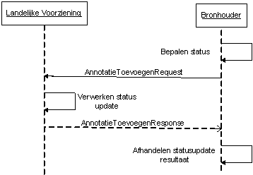
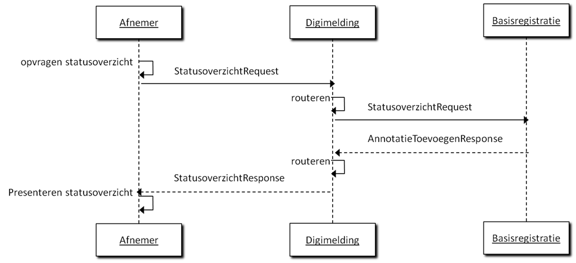
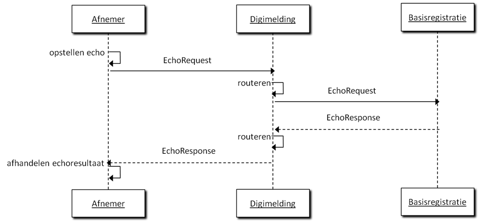

# Specificaties Services

Dit hoofdstuk beschrijft de berichten tussen terugmeldapplicatie,
Digimelding Webservice en de LV van basisregistraties (gerouteerd via
Digimelding Webservice)

Het interactiediagram biedt overzicht in hoe de berichten zich tot
elkaar verhouden en in welke volgorde de berichten worden gebruikt.

Per bericht wordt aangegeven (indien relevant):

-   berichtnaam;

-   trigger van het bericht;

-   verandering in terugmeldapplicatie/Digimelding Webservice/LV
    basisregistratie ten gevolge van het bericht;

-   lijst van objecten en velden in het bericht, en per veld:

    -   specificatie van de vulling van het veld,

    -   toelichting, bijvoorbeeld met de gebruikersactie of configuratie
        die nodig is om de juiste vulling te krijgen.

Tevens wordt bij de berichten een interactiediagram getoond waarin
duidelijk wordt welk systeem het bericht initieert.

## Annotaties Algemeen

De Digimelding-koppelvlakspecificatie (DMKS) die de basis vormt voor dit
koppelvlak gaat uit van annotaties. Alle informatie over een
terugmelding is vastgelegd in de vorm van een annotatie. Hierbij kent de
DMKS ook annotatiebomen waarbij root annotaties voorzien zijn van leaf
annotaties. De leafs zijn annotaties die een verwijzing bevatten naar de
UUID van de root annotatie waar ze aan hangen. In theorie is het
mogelijk dat een annotatie tegelijkertijd een root en leaf is, deze
annotatie hangt dan aan een andere 'root node' maar heeft zelf ook
leafs. Dit laatste komt in de huidige praktijk niet voor.

Iedere annotatie kent een basisset aan elementen: de 'annotatiebasis'
Deze worden bij iedere annotatie herhaald waardoor berichten behoorlijk
omvangrijk worden. Voor het overzicht wordt deze annotatie basis in de
volgende secties met specifieke berichten samengevat tot één regel
Annotatiebasis. Hieronder leggen we eenmalig uit welke elementen deze
annotatiebasis bevat.

| **Annotatiebasis**                                       |          |
| :---                                                     | :---     |
| \@uuid *Unieke identificatie van de annotatie.*       | \[1..1\] |
| GeannoteerdDoor *Gegevens van diegene die de annotatie heeft toegevoegd.* | \[1..1\] |
| GeannoteerdDoor . Oin *OIN van de terugmeldende organisatie.*             | \[1..1\] |
| GeannoteerdDoor . Vestiging *Vestigingsnummer van desbetreffende organisatie uit eHerkenning/SSOn Rijk (indien door de afnemer toegepast voor authenticatie).* | \[0..1\] |
| GeannoteerdDoor . Persoonsaanduiding *Deze zal met webservices bijna altijd de waarde "anoniem" hebben. Er zijn twee uitzonderingen. De eerste is wanneer nadere afspraken gemaakt zijn met een basisregistratie over de invulling van dit veld. De tweede is dat, indien binnen de organisatie eHerkenning/SSOn Rijk gebruikt is voor autorisatie en authenticatie, persoonsaanduiding uit eHerkenning/SSOn Rijk dient te worden meegegeven.*         | \[1..1\] |
| GeannoteerdOp *Tijdstempel waarop de annotatie heeft plaatsgevonden*.     | \[1..1\] |
| Toelichting *Een toelichting bij de annotatie. In de huidige praktijk in gebruik voor root annotaties en status leaf annotaties voor overige leaf annotaties in de huidige praktijk altijd leeg.*                         | \[0..1\] |
| Annotatieverwijzing *Verwijzing naar de root annotatie waar een leaf annotatie aan gerelateerd is. Dit wordt afhankelijk  van de relevantie opgenomen.*                          | \[0..1\] |

## Annotatie versturen

De berichten beschreven in deze uitwisseling worden gebruikt om:

-   met de terugmeldapplicatie van een afnemer een terugmelding te
    versturen
-   om een eerder door de afnemer gedane terugmelding in te trekken
-   om een status terug te melden van een bronhouder naar een Landelijke
    Voorziening

### Algemeen

| | |
|---|---|
| Doel          | Het toevoegen van een annotatie(boom) bij een op Digimelding aangesloten basisregistratie door een (medewerker van) een organisatie. Het effect van het annotatie toevoegen, **terugmelden** is het doen van een terugmelding. Het effect van een annotatie toevoegen, **intrekken** is het intrekken van een terugmelding.  Het effect van een annotatie toevoegen, **statuswijziging** is het geven van een statusupdate. |
| Voorwaarde    | Afname van gegevens uit basisregistraties door de terugmeldende organisatie, en het gedaan hebben van een check van de actuele waarde in de basisregistratie bij het doen van een terugmelding. Voor het **intrekken** van een terugmelding moet er al een terugmelding gedaan is. Voor het verzenden van een **statuswijziging** moet een terugmelding zijn ontvangen door de bronhouder |
| Trigger       | Gerede twijfel over de juistheid van een gegeven in een op Digimelding aangesloten basisregistratie bij een ambtenaar binnen de organisatie. Het terugkomen op de gerede twijfel van een eerder gedane terugmelding in het geval van **intrekken**. Het veranderen van een status door middel van een **statuswijziging** van een terugmelding bij een bronhouder. |
| Direct gevolg | Versturen van een bericht naar de betreffende bronhouder of landelijke voorziening.               |
| Vervolgactie  | De landelijke voorziening van de basisregistratie  neemt de terugmelding in behandeling. De gebruiker van de terugmeldende organisatie kan dit volgen  middels status opvragen. De landelijke voorziening verwerkt de statusupdate. |

### Scenario's Communicatie

### Inhoud bericht Annotatie ToevoegenRequest

| | |
|---|---|
| **AnnotatieToevoegenRequest**                          |            |
| OinBasisregistratie Het OIN van de houder van een landelijke voorziening van de basisregistratie | \[1..1\]   |
| Registratie Code (maximaal 3 letterig) waarmee de basisregistratie wordt aangeduid wanneer de houder van een landelijke  voorziening meer dan 1 basisregistratie beheert (bv BRT, BGT). | \[0..1\] |
| Annotatie *Dit element wordt alleen gevuld met een annotatie die moet worden ingetrokken.* | \[1..1\]\* |
| AnnotatieBoom *Bestaat uit minimaal één annotatie (de terugmelding) en de bijbehorende leafs.* | \[1..1\]\* |

\* De elementen Annotatie en AnnotatieBoom zijn onderdeel van een
verplicht keuzeveld: de AnnotatieToevoegenRequest bevat altijd slechts
één van de twee.

#### Annotatie toevoegen (terugmelden)

De structuur van de instanties van 'Annotatie' in de 'AnnotatieBoom' is
als volgt:

| | |
|---------------------------------------------------------|-----------|
| **AnnotatieBoom . Annotatie**                           | \[1..\*\] |
|---------------------------------------------------------|-----------|
| **Annotatie . Terugmelding**                            | \[1..1\]  |
| Terugmelding . **Annotatiebasis**                       |           |
| Terugmelding . Bronverwijzingen *Bronverwijzingen bestaande uit één of meerdere bronverwijzing* *Lijst van verwijzingen met basisregistratie elementen waarop wordt teruggemeld.* | \[1..1\] |
| Terugmelding . Bronverwijzingen . Bronverwijzing *Bestaande uit een URI en een selectieverwijzing naar het basisregistratie-element waarop wordt teruggemeld. Dit zijn er meerdere, maar in de huidige praktijk is dit er altijd precies één.* | \[1..\*\] |
| Terugmelding . Bronverwijzingen . Bronverwijzing .  Uri  *Een combinatie van OIN en de unieke sleutel van het brongegeven zodat een unieke referentie ontstaat naar het brongegeven (bijv. OIN en HRN).* | \[1..1\] |
| Terugmelding . Bronverwijzingen . Bronverwijzing . Selectie  *Selectie van een element binnen de structuur die door de URI uniek geïdentificeerd wordt (bijvoorbeeld onderneming).* | \[0..\*\] |
| Terugmelding . Attributenset  *De set van attributen die daadwerkelijk gewijzigd dienen te worden.* | \[1..1\] |
| Attribuut *Eén of meerdere attributen die gewijzigd dienen te worden.* | \[1..\*\] |
| Attribuut . Uri De unieke aanduiding van het attribuut | \[1..1\] |
| Attribuut . BetwijfeldeWaarde *De bestaande waarde in de basisregistratie.*  | \[0..1\] |
| Attribuut . VoorgesteldeWaarde *De voorgestelde nieuwe waarde.* | \[0..1\] |
| Terugmelding . Peilmoment *De datum waarop de betwijfelde waarde geldig is en de voorgestelde waarde geldig zou moeten zijn.* | \[0..1\] |
|---------------------------------------------------------|-----------|
| **Annotatie . Annotatiestatus** *Status van de terugmelding* | \[1..\*\] |
| Annotatiestatus . **Annotatiebasis**                    |           |
| Annotatiestatus . Status  *Zie bijlage B voor lijst met geadviseerde statussen voor aangesloten basisregistraties.(Het is toegestaan om in de eigen catalogus afwijkende statussen op te nemen)* | \[1..1\]  |
|---------------------------------------------------------|-----------|
| **Annotatie . Referentiekenmerk** *Eigen kenmerk terugmeldende organisatie (het mogen er meer zijn, in de huidige praktijk altijd precies één).* | \[1..\*\] |
| Referentiekenmerk . **Annotatiebasis**                  |           |
| Referentiekenmerk . Kenmerk *Eigen kenmerk terugmeldende organisatie.* *In de huidige praktijk maximaal 12 posities* | \[1..1\]  |
|---------------------------------------------------------|-----------|
| **Annotatie . Contactinformatie** *Contactgegevens*  | \[1..\*\] |
| Contactinformatie . \@ContactType *kan alleen de waarden \'Melder\' of \'Behandelaar\' hebben* | \[1..1\] |
| Contactinformatie . **Annotatiebasis**                  |           |
| Contactinformatie . Naam                                | \[1..1\]  |
| Contactinformatie . Telefoon                            | \[0..1\]  |
| Contactinformatie . Email                               | \[1..1\]  |
| Contactinformatie . Afdeling                            | \[0..1\]  |
|---------------------------------------------------------|-----------|
| **Annotatie . Bijlageverwijzing**                       | \[0..\*\] |
|---------------------------------------------------------|-----------|
| > *HR ondersteunt maximaal 5 bijlagen.*                 |           |
| Bijlageverwijzing . **Annotatiebasis**                  |           |
| Bijlageverwijzing . Bestandsnaam *De naam van het bestand.*  | \[1..1\]  |
| Bijlageverwijzing . MIMEType *Het MIME type van de bijlage.* | \[1..1\]  |
| Bijlageverwijzing . BijlageData *Het bestand zelf in Base64-binary encoding.* | \[1..1\]  |
| Bijlageverwijzing . Beschrijving *Beschrijving van de bijlage. De bijlage zelf wordt nooit mee teruggeleverd bij het bevragen van een terugmelding/annotatie.* | \[0..1\] |
|---------------------------------------------------------|-----------|
| **Annotatie . BehandelendeBronhouder** *Behandelende bronhouder* | \[0 \*\]  |
| BehandelendeBronhouder . **Annotatiebasis**             |           |
| BehandelendeBronhouder . Bronhouder *De gewenste bronhouder*     | \[1..1\]  |

#### Annotatie toevoegen (intrekken)

De volgende structuur is in de XML-structuur child van de 'Annotatie'.

| | |
|---------------------------------------------------------|-----------|
| **Annotatiestatus** *Status van de terugmelding.*    | \[1..\*\] |
| **Annotatiestatus . Annotatiebasis** Inclusief toelichting en annotatieverwijzing  |           |
| Annotatiestatus . Status Een afnemer kan bij het doen van een intrekking alleen de status: INGETROKKEN gebruiken in de huidige praktijk. | \[0..1\]  |

**Annotatie toevoegen (statuswijziging)**
De volgende structuur is in de XML-structuur child van de 'Annotatie'.

| | |
|---------------------------------------------------------|-----------|
| **Annotatiestatus** *Status van de terugmelding.*    | \[1..\*\] |
| **Annotatiestatus . Annotatiebasis** Inclusief toelichting en annotatieverwijzing   |           |
| Annotatiestatus . Status *Zie bijlage B voor lijst met geadviseerde statussen voor aangesloten basisregistraties.(Het is toegestaan om in de eigen catalogus afwijkende statussen op te nemen)* | \[0..1\]  |
| Annotatiestatus . Statustype                            | \[0..1\]  |
|---------------------------------------------------------|-----------|
| **Annotatie . Contactinformatie** *Contactgegevens.* | \[0..\*\] |
| Contactinformatie . \@ContactType *kan alleen de waarden \'Melder\' of \'Behandelaar\' hebben* | \[1..1\]  |
| **Contactinformatie . Annotatiebasis**                  |           |
| Contactinformatie . Naam                                | \[1..1\]  |
| Contactinformatie . Telefoon                            | \[0..1\]  |
| Contactinformatie . Email                               | \[1..1\]  |
| Contactinformatie . Afdeling                            | \[0..1\]  |
|---------------------------------------------------------|-----------|
| **Annotatie . Planningsverwachting** *Verwachte termijn voor behandeling* | \[0..\*\] |
| Planningsverwachting . **Annotatiebasis**               |           |
| Planningsverwachting . MijlpaalAanduiding *Beschrijving van de planningsverwachting.* | \[0..1\] |
| Planningsverwachting . MijlpaalTijdstempel *Datum waarop de planning gereed is.*      | \[0..1\] |
|---------------------------------------------------------|-----------|
| **Annotatie . BehandelendeBronhouder** *Behandelende bronhouder* | \[0 \*\] |
| BehandelendeBronhouder . **Annotatiebasis**             |           |
| BehandelendeBronhouder . Bronhouder *De gewenste bronhouder (bij status "Verkeerde Bronhouder")* | \[1..1\] |

Optioneel kan bij een statuswijziging worden meegezonden:

Planningsverwachting, Contactinformatie en Behandelendbronhouder
(hiermee kan bij de statuswijziging *"Verkeerde Bronhouder"* de gewenste
bronhouder worden aangegeven).

#### Annotatie toevoegen (aanpassing)

Het antwoord op het toevoegen van een annotatie of het nu een
annotatieboom met volledige terugmelding is of een annotatie voor een
intrekking is altijd een AnnotatieToevoegenResponse-bericht met daarin
een tijdstempel. Het is een zogeheten functionele acknowledgement wat
betekent dat de achterliggende (TMV-)applicatie het vraagbericht in
goede orde ontvangen heeft.

| | |
|----------------------------------------------------------|----------|
|----------------------------------------------------------|----------|
| **Berichttype:** AnnotatieToevoegenResponse              |          |
| **Elementen/attributen**                                 |          |
| AnnotatieToevoegenResponse                               |          |
| AnnotatieToevoegenResponse . Tijdstempel *Tijd waarop antwoord verstuurd is.* | \[1..1\] |
| AnnotatieToevoegenResponse . AnnotatieVerwijzing *UUID van de toegevoegde annotatie waar het antwoord betrekking op heeft.* | \[1..1\] |

## Status bevragen

Deze interactie wordt gebruikt door de afnemer om meer informatie te
verkrijgen over de door zijn organisatie gedane terugmeldingen en de
huidige status van deze terugmeldingen.

### Algemeen

  |      |      |
  | :--- | :--- |
  | Doel           |  Het opvragen van de status van terugmeldingen van een terugmeldende organisatie. |
  | Voorwaarde     |  De organisatie heeft terugmeldingen gedaan.                                |
  | Trigger        |  Een gebruiker wil de status van terugmeldingen van zijn organisatie weten. |
  | Direct gevolg  |  De gebruiker is geïnformeerd over de status en eventueel extra detailinformatie van de terugmeldingen die hem interesseren.     |
  | Vervolgactie   |  De gebruiker kan terugmeldingen van zijn organisatie intrekken op basis van de informatie verstrekt in het status overzicht. |
  | Bijzonderheden  | \- |

### StatusoverzichtRequest

Het bericht StatusoverzichtRequest wordt gebruikt in de communicatie
tussen Afnemer en LV/Basisregistratie alsook tussen LV/Basisregistratie
en Bronhouder om een statusoverzicht op te vragen.

Ter illustratie onderstaand de interactie tussen Afnemer en
Basisregistratie.

Het statusoverzicht wordt opgevraagd op basis van de verplichte
elementen OIN en basisregistratie. Het OIN is verplicht omdat alle
aangesloten basisregistraties alleen van plan zijn terugmeldingen van de
afnemer zelf terug te geven. Basisregistratie is verplicht, omdat dit
het doorgeven van functionele fouten door de Digimelding Webservice
vergemakkelijkt. Dit is een beperkte voorziening, het samenvoegen van
overzichtsberichten zou de complexiteit verhogen en vooral op een goede
wijze functionele fouten over meerdere basisregistraties heen geven,
levert teveel complexiteit op. In het geval dat het opgeven van één
basisregistratie verplicht is routeert de Digimelding Webservice
slechts. Naast deze verplichte elementen is er een aantal optionele
elementen waarmee de resultaten gefilterd kunnen worden. Een lijst met
kenmerken van de organisatie zelf kan worden meegegeven. Dit is handig
wanneer de afnemer een eigen registratiesysteem heeft. Daarnaast kan
gefilterd worden op de datum van indienen en de datum van laatste
wijziging. Tot slot kan er gefilterd worden op de status van
terugmeldingen. Dit is enigszins bewerkelijk aangezien iedere
basisregistratie zijn eigen statussen mag definiëren. In de
berichtenschema's is daarom slechts vastgelegd dat dit een string is.

+---------------------------------------------------------+-----------+
| **Berichttype**: StatusoverzichtRequest                 |           |
+=========================================================+===========+
| **Elementen/attributen**                                |           |
+---------------------------------------------------------+-----------+
| OinVragendeOrganisatie                                  | \[1..1\]  |
|                                                         |           |
| *OIN van de vragende organisatie.*                      |           |
+---------------------------------------------------------+-----------+
| OinBasisregistratie                                     | \[1..1\]  |
|                                                         |           |
| *\                                                      |           |
| *Het OIN van de houder van een landelijke voorziening   |           |
| van de basisregistratie                                 |           |
+---------------------------------------------------------+-----------+
| Registratie                                             | \[0..1\]  |
|                                                         |           |
| Code (maximaal 3 letterig) waarmee de basisregistratie  |           |
| wordt aangeduid wanneer de houder van een landelijke    |           |
| voorziening meer dan 1 basisregistratie beheert (bv     |           |
| BRT, BGT).                                              |           |
+---------------------------------------------------------+-----------+
| **Filter**                                              | \[0..1\]  |
+---------------------------------------------------------+-----------+
| Filter.MeldingskenmerkenLijst                           | \[0..1\]  |
|                                                         |           |
| *(Lijst met)Eigen kenmerk(en) terugmeldende             |           |
| organisatie.*                                           |           |
+---------------------------------------------------------+-----------+
| Fi                                                      | \[1..\*\] |
| lter.MeldingskenmerkenLijst.MeldinggkenmerkLijstElement |           |
+---------------------------------------------------------+-----------+
| Filter.VanafTijdstempelIndienen                         | \[0..1\]  |
|                                                         |           |
| *Filtert resultaten die zijn ingediend voor dit         |           |
| tijdstempel weg. Resultaten op de tijdstempel of daarna |           |
| worden getoond.*                                        |           |
+---------------------------------------------------------+-----------+
| Filter.TotEnMetTijdstempelIndienen                      | \[0..1\]  |
|                                                         |           |
| *Filtert resultaten die zijn ingediend na dit           |           |
| tijdstempel weg. Resultaten op de tijdstempel of        |           |
| daarvoor worden getoond.*                               |           |
+---------------------------------------------------------+-----------+
| Filter.VanafTijdstempelWijziging                        | \[0..1\]  |
|                                                         |           |
| *Filtert resultaten die zijn gewijzigd voor dit         |           |
| tijdstempel weg. Resultaten op de tijdstempel of daarna |           |
| worden getoond.(\*)\                                    |           |
| *                                                       |           |
+---------------------------------------------------------+-----------+
| Filter.TotEnMetTijdstempelWijziging                     | \[0..1\]  |
|                                                         |           |
| *Filtert resultaten die zijn gewijzigd na dit           |           |
| tijdstempel weg. Resultaten op de tijdstempel of        |           |
| daarvoor worden getoond.(\*)*                           |           |
+---------------------------------------------------------+-----------+
| Filter.StatusTerugmelding                               | \[0..1\]  |
|                                                         |           |
| *String met daarin een status behorende bij de          |           |
| basisregistratie waarvan het overzicht gevraagd wordt.* |           |
+---------------------------------------------------------+-----------+
| Filter.Objectidentificatie                              | \[0..1\]  |
|                                                         |           |
| *String met daarin een objectidentificatie behorende    |           |
| bij de basisregistratie waarvan het overzicht gevraagd  |           |
| wordt. Hiermee kunnen terugmeldingen ook op basis van   |           |
| KvK-nummer, BSN-nummer, BAG-id, etc teruggevonden       |           |
| worden.*                                                |           |
+---------------------------------------------------------+-----------+

(\*) *Het resultaat* betreft terugmeldingen (annotatiebomen) waarvoor
geldt dat **de laatste annotatie** is toegevoegd tussen
VanafTijdstempelWijziging en TotEnMetTijdstempelWijziging

### StatusoverzichtResponse

Het statusoverzicht geeft een lijst met annotaties terug. Dit zijn in
dit geval altijd 'root' annotaties waar een annotatieboom aan hangt. Dit
is noodzakelijk omdat een aantal van de kenmerken die in de
annotatielijst verplicht worden meegegeven afkomstig zijn uit leaf
annotaties van een annotatieboom.

Wanneer het antwoord op een statusoverzichtbevraging niets oplevert
wordt een lege lijst meegegeven. In lijn met het 'gemeenschappelijke
afspraken berichtstandaarden'-voorstel voor 'geen waarde' wordt hierbij
als reden meegegeven 'geenWaarde'. Een regulier antwoordbericht is in
deze foutsituaties op zijn plaats omdat dit geen kritieke fouten zijn en
het aan de afnemer is om te bepalen of hier actie op moet worden
ondernomen.

+---------------------------------------------------------+-----------+
| **Berichttype**: StatusoverzichtResponse                |           |
+=========================================================+===========+
| **Elementen/attributen**                                |           |
+---------------------------------------------------------+-----------+
| **AnnotatieLijst**                                      | \[1..\*\] |
+---------------------------------------------------------+-----------+
| Annotatie                                               | \[0..\*\] |
+---------------------------------------------------------+-----------+
| Annotatie . Tijdstempel                                 | \[1..1\]  |
|                                                         |           |
| *Datum/tijd waarop de annotatie heeft plaatsgevonden*   |           |
+---------------------------------------------------------+-----------+
| Annotatie . Uuid                                        | \[1..1\]  |
|                                                         |           |
| *Unieke verwijzing naar de root annotatie van een       |           |
| annotatieboom.*                                         |           |
+---------------------------------------------------------+-----------+
| Annotatie . Meldingskenmerk                             | \[1..1\]  |
|                                                         |           |
| *Eigen kenmerk terugmeldende organisatie.*              |           |
+---------------------------------------------------------+-----------+
| Annotatie . Bronverwijzing                              | \[1..1\]  |
+---------------------------------------------------------+-----------+
| Annotatie . Bronverwijzing . Uri                        | \[1..1\]  |
|                                                         |           |
| *Een combinatie van OIN en de unieke sleutel van het    |           |
| brongegeven zodat een unieke referentie ontstaat naar   |           |
| het brongegeven (bijv. OIN en HRN).*                    |           |
+---------------------------------------------------------+-----------+
| Annotatie . Bronverwijzing . Selectie                   | \[0..1\]  |
|                                                         |           |
| *Object waarop is teruggemeld.*                         |           |
+---------------------------------------------------------+-----------+
| Annotatie . Annotatiestatus                             | \[1..1\]  |
|                                                         |           |
| *Laatste status annotatie van de terugmelding.*         |           |
+---------------------------------------------------------+-----------+

### DetailsTerugmeldingRequest

Het bericht DetailsTerugmeldingRequest wordt gebruikt in de communicatie
tussen Afnemer en LV/Basisregistratie alsook tussen LV/Basisregistratie
en Bronhouder om details van een bepaalde terugmelding op te vragen.

Ter illustratie onderstaand de interactie tussen Afnemer en
Basisregistratie.

Het doel van dit bericht is het opvragen van alle informatie over één
terugmelding bij een basisregistratie. Hiervoor wordt het OIN van de
afnemer meegegeven en de basisregistratie waar de detailopvraging wordt
gedaan, tot slot wordt de UUID van de annotatie meegegeven. In de
huidige praktijk gaat het altijd om een UUID van een root annotatie.
Volgens het protocol kan ook een individuele leaf annotatie of een
deelboom worden opgevraagd. Dit is nu in theorie mogelijk maar wordt in
de praktijk niet toegepast en is niet getest.

+----------------------------------------------------------+----------+
| **Berichttype**: DetailsTerugmeldingRequest              |          |
+==========================================================+==========+
| **Elementen/attributen**                                 |          |
+----------------------------------------------------------+----------+
| OinVragendeOrganisatie                                   | \[1..1\] |
|                                                          |          |
| *Identificatie d.m.v. OIN-vragende organisatie.*         |          |
+----------------------------------------------------------+----------+
| OinBasisregistratie                                      | \[1..1\] |
|                                                          |          |
| *\                                                       |          |
| *Het OIN van de houder van een landelijke voorziening    |          |
| van de basisregistratie                                  |          |
+----------------------------------------------------------+----------+
| Registratie                                              | \[0..1\] |
|                                                          |          |
| Code (maximaal 3 letterig) waarmee de basisregistratie   |          |
| wordt aangeduid wanneer de houder van een landelijke     |          |
| voorziening meer dan 1 basisregistratie beheert (bv BRT, |          |
| BGT).                                                    |          |
+----------------------------------------------------------+----------+
| Uuid                                                     | \[1..1\] |
|                                                          |          |
| *UUID van root annotatie.*                               |          |
+----------------------------------------------------------+----------+

### DetailsTerugmeldingResponse

Op basis van een UUID geeft een basisregistratie de annotatie met
daaraan hangende leafs terug als antwoord. Op dit moment is dat altijd
een toevoeging of wijziging (terugmelding) als root annotatie met
daaraan altijd tenminste één van elk van de volgende leafs: contact,
meldingskenmerk en/of status. Daarnaast worden optioneel één of meerdere
leafs van het type: Bijlageverwijzing en Planningsverwachting
meegegeven.

Een basisregistratie moet het opvragen van root annotaties met eraan
hangende boom ondersteunen, daarnaast mag een basisregistratie
annotatie(bomen) teruggeven van niet root annotaties, dit is echter nu
nog niet gerealiseerd of getest. Aangezien het statusoverzicht alleen
root annotaties oplevert zal het opvragen van andere soorten annotaties
in de praktijk ook niet snel voorkomen.

Doordat de annotatiebasis in iedere annotatie zit wordt de annotatieboom
een behoorlijk lijvige constructie. In de onderstaande berichten wordt
deze daarom tot één regel afgekort. Zie paragraaf 4.1 voor een
uitgebreide toelichting van wat er in de annotatiebasis staat. Elke
annotatie kent een eigen instantie, zoals ook bij
'AnnotatieToevoegenRequest' en elke annotatie kan slechts één van de
volgende soorten annotaties bevatten: Terugmelding, Annotatiestatus,
Referentiekenmerk, Contactinformatie, Bijlageverwijzing,
Planningsverwachting en BehandelendeBronhouder.

+---------------------------------------------------------+-----------+
| **Berichttype**: DetailsTerugmeldingResponse            |           |
+=========================================================+===========+
| **Elementen/attributen**                                |           |
+---------------------------------------------------------+-----------+
| **AnnotatieBoom**                                       | \[1..1\]  |
|                                                         |           |
| > *De container die de verzameling annotaties bevat die |           |
| > ofwel het gevraagde UUID als kenmerk hebben of daar   |           |
| > middels een annotatieverwijzing naar verwijzen.*      |           |
+---------------------------------------------------------+-----------+
|                                                         |           |
+---------------------------------------------------------+-----------+
| **Annotatie . Terugmelding**                            | \[1..1\]  |
|                                                         |           |
| *De terugmelding (de annotatie die uiteindelijk de root |           |
| annotatie zal worden)*                                  |           |
+---------------------------------------------------------+-----------+
| Terugmelding . **Annotatiebasis**                       |           |
+---------------------------------------------------------+-----------+
| Terugmelding . Bronverwijzingen                         | \[1..1\]  |
|                                                         |           |
| > *Bronverwijzingen bestaande uit één of meerdere       |           |
| > bronverwijzing(en)*                                   |           |
| >                                                       |           |
| > *Lijst van verwijzingen met basisregistratie          |           |
| > elementen waarop wordt teruggemeld.*                  |           |
+---------------------------------------------------------+-----------+
| Bronverwijzingen . Bronverwijzing                       | \[1..\*\] |
|                                                         |           |
| > *Bestaande uit een URI en een selectieverwijzing naar |           |
| > het basisregistratie element waarop wordt             |           |
| > teruggemeld. Dit mogen er meerdere zijn, maar in de   |           |
| > huidige praktijk is dit er altijd precies één.*       |           |
+---------------------------------------------------------+-----------+
| Bronverwijzing.Uri                                      | \[1..1\]  |
|                                                         |           |
| > *De URI die de combinatie van basisregistratie en     |           |
| > sleutel (bijvoorbeeld BSN of HRN) uniek               |           |
| > identificeert.*                                       |           |
+---------------------------------------------------------+-----------+
| Bronverwijzing.Selectie                                 | \[0..\*\] |
|                                                         |           |
| > *Selectie van een element binnen de structuur die     |           |
| > door de URI uniek geïdentificeerd wordt (bijvoorbeeld |           |
| > onderneming).*                                        |           |
+---------------------------------------------------------+-----------+
| Terugmelding . Attributenset                            | \[1..1\]  |
|                                                         |           |
| > *De set van attributen die daadwerkelijk gewijzigd    |           |
| > dienen te worden.*                                    |           |
+---------------------------------------------------------+-----------+
| Attributenset . Attribuut                               | \[1..\*\] |
|                                                         |           |
| > *Eén of meerdere attributen die gewijzigd dienen te   |           |
| > worden.*                                              |           |
+---------------------------------------------------------+-----------+
| Attribuut . Uri                                         | \[1..1\]  |
|                                                         |           |
| > De unieke aanduiding van het attribuut                |           |
+---------------------------------------------------------+-----------+
| Attribuut . BetwijfeldeWaarde                           | \[0..1\]  |
|                                                         |           |
| > *De bestaande waarde in de basisregistratie.*         |           |
+---------------------------------------------------------+-----------+
| Attribuut . VoorgesteldeWaarde                          | \[0..1\]  |
|                                                         |           |
| > *De voorgestelde nieuwe waarde.*                      |           |
+---------------------------------------------------------+-----------+
| Terugmelding . Peilmoment                               | \[0..1\]  |
|                                                         |           |
| > *De datum waarop de betwijfelde waarde geldig is en   |           |
| > de voorgestelde waarde geldig zou moeten zijn.*       |           |
+---------------------------------------------------------+-----------+
|                                                         |           |
+---------------------------------------------------------+-----------+
| **Annotatie . Annotatiestatus**                         | \[1..\*\] |
|                                                         |           |
| > *Status van de terugmelding, de status met de meest   |           |
| > recente datum GeannoteerdOp is de geldige status.*    |           |
+---------------------------------------------------------+-----------+
| Annotatiestatus . **Annotatiebasis**                    |           |
+---------------------------------------------------------+-----------+
| Annotatiestatus . Status                                | \[1..1\]  |
|                                                         |           |
| > *Zie bijlage B voor lijst met geadviseerde statussen  |           |
| > voor aangesloten basisregistraties. Het is toegestaan |           |
| > om in de eigen catalogus afwijkende statussen op te   |           |
| > nemen)\                                               |           |
| > *                                                     |           |
+---------------------------------------------------------+-----------+
|                                                         |           |
+---------------------------------------------------------+-----------+
| **Annotatie . Referentiekenmerk**                       | \[1 \*\]  |
|                                                         |           |
| > *Eigen kenmerk terugmeldende organisatie (het mogen   |           |
| > er meer zijn, in de huidige praktijk altijd precies   |           |
| > één).*                                                |           |
+---------------------------------------------------------+-----------+
| **Referentiekenmerk.Annotatiebasis**                    |           |
+---------------------------------------------------------+-----------+
| Referentiekenmerk.Kenmerk                               | \[1..1\]  |
|                                                         |           |
| > *Eigen kenmerk terugmeldende organisatie.*            |           |
+---------------------------------------------------------+-----------+
|                                                         |           |
+---------------------------------------------------------+-----------+
| **Annotatie . Contactinformatie**                       | \[1 \*\]  |
|                                                         |           |
| > *Contactgegevens.*                                    |           |
+---------------------------------------------------------+-----------+
| Contactinformatie . \@ContactType                       | \[1..1\]  |
|                                                         |           |
| *kan alleen de waarden \'Melder\' of \'Behandelaar\'    |           |
| hebben*                                                 |           |
+---------------------------------------------------------+-----------+
| **Contactinformatie . Annotatiebasis**                  |           |
+---------------------------------------------------------+-----------+
| Contactinformatie . Naam                                | \[1..1\]  |
+---------------------------------------------------------+-----------+
| Contactinformatie . Telefoon                            | \[0..1\]  |
+---------------------------------------------------------+-----------+
| Contactinformatie . Email                               | \[1..1\]  |
+---------------------------------------------------------+-----------+
| Contactinformatie . Afdeling                            | \[0..1\]  |
+---------------------------------------------------------+-----------+
|                                                         |           |
+---------------------------------------------------------+-----------+
| **Annotatie . Bijlageverwijzing**                       | \[0..\*\] |
|                                                         |           |
| > *Metainformatie over bijlagen.*                       |           |
| >                                                       |           |
| > *Wordt in de praktijk niet ondersteund door BRP, HR   |           |
| > ondersteunt er maximaal 5.*                           |           |
+---------------------------------------------------------+-----------+
| Bijlageverwijzing . **Annotatiebasis**                  |           |
+---------------------------------------------------------+-----------+
| Bijlageverwijzing . Bestandsnaam                        | \[1..1\]  |
|                                                         |           |
| *De naam van het bestand.*                              |           |
+---------------------------------------------------------+-----------+
| Bijlageverwijzing . MIMEType                            | \[1..1\]  |
|                                                         |           |
| *Het MIME type van de bijlage.*                         |           |
+---------------------------------------------------------+-----------+
| Bijlageverwijzing . BijlageData                         | \[1..1\]  |
|                                                         |           |
| *Het bestand zelf in Base64-binary encoding.(\*)\       |           |
| (\* Dit veld wordt bij een bericht                      |           |
| '*DetailsTerugmeldingResponse' leeg gelaten )           |           |
+---------------------------------------------------------+-----------+
| Bijlageverwijzing . Beschrijving                        | \[0..1\]  |
|                                                         |           |
| > *Beschrijving van de bijlage. De bijlage zelf wordt   |           |
| > nooit mee teruggeleverd bij het bevragen van een      |           |
| > terugmelding/annotatie.\                              |           |
| > *                                                     |           |
+---------------------------------------------------------+-----------+
|                                                         |           |
+---------------------------------------------------------+-----------+
| **Annotatie . Planningsverwachting**                    | \[0..\*\] |
|                                                         |           |
| > *Verwachte termijn voor behandeling, wordt alleen     |           |
| > gebruikt door BRP en komt dan slechts eenmaal voor.*  |           |
+---------------------------------------------------------+-----------+
| Planningsverwachting . **Annotatiebasis**               |           |
+---------------------------------------------------------+-----------+
| Planningsverwachting . MijlpaalAanduiding               | \[0..1\]  |
|                                                         |           |
| > *Beschrijving van de planningsverwachting.*           |           |
+---------------------------------------------------------+-----------+
| Planningsverwachting . MijlpaalTijdstempel              | \[0..1\]  |
|                                                         |           |
| > *Datum waarop de planning gereed is.*                 |           |
+---------------------------------------------------------+-----------+
|                                                         |           |
+---------------------------------------------------------+-----------+
| **Annotatie . BehandelendeBronhouder**                  | \[0 \*\]  |
|                                                         |           |
| > *Behandelende bronhouder, huidige behandelaar is leaf |           |
| > annotatie met meest recente tijdstempel.*             |           |
+---------------------------------------------------------+-----------+
| BehandelendeBronhouder . **Annotatiebasis**             |           |
+---------------------------------------------------------+-----------+
| BehandelendeBronhouder . Bronhouder                     | \[1..1\]  |
|                                                         |           |
| > *De bronhouder die de terugmelding momenteel in       |           |
| > behandeling heeft.*                                   |           |
+---------------------------------------------------------+-----------+

## Echo

De berichten beschreven in deze uitwisseling kunnen worden gebruikt om
te controleren of de berichtverwerking in zijn algemeenheid beschikbaar
is.

### Algemeen

  ---------------- ------------------------------------------------------------------------------------------------------------
  Doel             Het ontvangen van een antwoordbericht waaruit blijkt dat de berichtverwerking conform specificaties werkt.
  Voorwaarde       Geen.
  Trigger          Behoefte om te controleren of berichtverwerking naar behoren functioneert.
  Direct gevolg    Terugsturen van een echobericht.
  Vervolgactie     Indien de echo faalt onderzoeken waardoor dit wordt veroorzaakt.
  Bijzonderheden   
  ---------------- ------------------------------------------------------------------------------------------------------------

### EchoRequest

De structuur van het echoverzoek is als volgt:

+----------------------------------------------------------+----------+
| **Berichttype: EchoRequest**                             |          |
+==========================================================+==========+
|                                                          |          |
+----------------------------------------------------------+----------+
| EchoRequest . OinBasisregistratie                        | \[1..1\] |
|                                                          |          |
| *Het OIN van de basisregistratie waar het echoverzoek    |          |
| naar toe moet*                                           |          |
+----------------------------------------------------------+----------+
| EchoRequest .OinBasisregistratie                         | \[1..1\] |
|                                                          |          |
| *\                                                       |          |
| *Het OIN van de houder van een landelijke voorziening    |          |
| van de basisregistratie                                  |          |
+----------------------------------------------------------+----------+
| EchoRequest . Registratie                                | \[0..1\] |
|                                                          |          |
| Code (maximaal 3 letterig) waarmee de basisregistratie   |          |
| wordt aangeduid wanneer de houder van een landelijke     |          |
| voorziening meer dan 1 basisregistratie beheert (bv BRT, |          |
| BGT).                                                    |          |
+----------------------------------------------------------+----------+
| EchoRequest . Echo                                       | \[1..1\] |
|                                                          |          |
| De string die geëchood moet worden                       |          |
+----------------------------------------------------------+----------+

### EchoResponse

De structuur van het echo-antwoord is als volgt:

+-------------------------------+----------+
| **Berichttype: EchoResponse** |          |
+===============================+==========+
|                               |          |
+-------------------------------+----------+
| EchoResponse . Echo           | \[1..1\] |
|                               |          |
| De teruggestuurde echo string |          |
+-------------------------------+----------+
