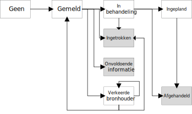

# bijlagen

## Bijlage A: Afkortingen, begrippen en symbolen

| **Afkorting** | **Omschrijving**                           |
|---------------|------------------------------------------- |
|  BAG          |  Basisregistratie Adressen en Gebouwen     |
|  BRP          |  Basisregistratie Personen                 |
|  GEMMA        |  Gemeentelijke modelarchitectuur           |
|  ICTU         |  ICT Uitvoeringsorganisatie                |
|  KING         |  Kwaliteitsinstituut Nederlandse Gemeenten |
|  HR           |  Handelsregister                           |
|  NUP          |  Nationaal Uitvoeringsprogramma            |
|  StUF         |  Standaarduitwisselingsformaat             |

## Bijlage B : Geadviseerde Statussen

*Diagram*

Op een terugmelding kunnen verschillende statussen van toepassing zijn.
In onderstaand figuur zijn de verschillende statussen en hun relatie
afgebeeld.

*Definities*

  naar                     *geen*   Gemeld   In behandeling   Ingetrokken   Onvoldoende informatie   Verkeerde Bronhouder   Ingepland   Afgehandeld   
  ------------------------ -------- -------- ---------------- ------------- ------------------------ ---------------------- ----------- ------------- --
  van                                                                                                                                                 
  *Geen*                            x                                                                                                                 
  Gemeld                                     x                x             x                        x                                                
  In behandeling                                              x                                                             x           x             
  Ingetrokken                                                                                                                                         
  Onvoldoende informatie                                                                                                                              
  Verkeerde Bronhouder              x                         x                                       x                                               
  Ingepland                                                                                                                             x             
  Afgehandeld                                                                                                                                         

  Eindstatus                                                                                                                                          
  overgang mogelijk        X                                                                                                                          
