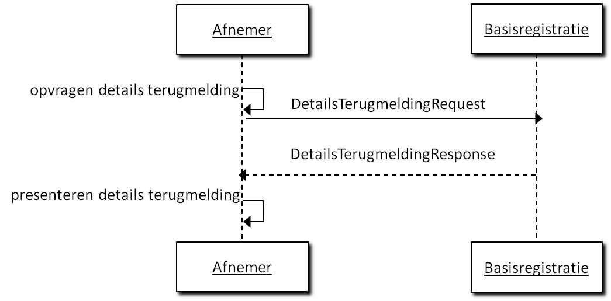

Colofon

| Logius Servicecentrum:  | Postbus 96810 2509 JE Den Haag  t. 0900 555 4555 (10 ct p/m) e. [servicecentrum@logius.nl](mailto:servicecentrum@logius.nl)   |
|-------------------------|-------------------------------------------------------------------------------------------------------------------------------|
|                         |                                                                                                                               |

Documentbeheer

| Datum       | Versie | Auteur | Opmerkingen                            |
|-------------|--------|--------|----------------------------------------|
| 13-02-2015  | 0.1    | Logius | Eerste concept                         |
|             | 0.2    |        |                                        |
| 28-10-2015  | 0.9    | Logius | Diverse spellingsverbeteringen.        |
| 31-03-2016  | 0.91   | Logius | Aanpassingen n.a.v. bevindingen pilot  |
| 30-03-2016  | 1.0    | Logius | Definitief na goedkeuring Afnemersraad |
| 14-05-2018  | 1.1    | Logius | RFC Behandelend Bronhouder             |
| 21-11-2019  | 1.2    | Logius | Zie release notes                      |
| 24-06-2020  | 1.2.1  | Logius | Tekstuele aanpassingen / correcties    |
|             |        |        |                                        |

Inhoud

[1	Inleiding	4](#_Toc25242110)

>   [1.1	Achtergrond	4](#_Toc25242111)

>   [1.2	Bronverwijzing en referentiedocumenten	4](#_Toc25242112)

[2	Functionaliteit op hoofdlijnen en architectuur	5](#_Toc25242113)

>   [2.1	Referentiearchitectuur	5](#_Toc25242114)

[3	Beveiliging, autorisatie en protocollen	7](#_Toc25242115)

>   [3.1	Authenticatie en autorisatie	7](#_Toc25242116)

[4	Specificaties Services	9](#_Toc25242117)

>   [4.1	Annotaties Algemeen	9](#_Toc25242118)

>   [4.2	Annotatie versturen	10](#_Toc25242119)

>   [4.2.1	Algemeen	10](#_Toc25242120)

>   [4.2.2	Scenario’s Communicatie	11](#_Toc25242121)

>   [4.2.3	Inhoud bericht Annotatie ToevoegenRequest	12](#_Toc25242122)

>   [4.2.4	AnnotatieToevoegenResponse	16](#_Toc25242123)

>   [4.3	Status bevragen	16](#_Toc25242124)

>   [4.3.1	Algemeen	17](#_Toc25242125)

>   [4.3.2	StatusoverzichtRequest	17](#_Toc25242126)

>   [4.3.3	StatusoverzichtResponse	20](#_Toc25242127)

>   [4.3.4	DetailsTerugmeldingRequest	20](#_Toc25242128)

>   [4.3.5	DetailsTerugmeldingResponse	22](#_Toc25242129)

>   [4.4	Echo	24](#_Toc25242130)

>   [4.4.1	Algemeen	24](#_Toc25242131)

>   [4.4.2	EchoRequest	25](#_Toc25242132)

>   [4.4.3	EchoResponse	26](#_Toc25242133)

[5	Foutberichten	27](#_Toc25242134)

>   [5.1	Autorisatiefouten	27](#_Toc25242135)

>   [5.2	Verwerkingsfouten	27](#_Toc25242136)

>   [5.3	Syntaxfouten	28](#_Toc25242137)

>   [5.4	Generieke foutcodes van toepassing op Digimelding	30](#_Toc25242138)

>   [5.5	Foutcodes basisregistraties	31](#_Toc25242139)

[Bijlage A: Afkortingen, begrippen en symbolen	32](#_Toc25242140)

[Bijlage B : Geadviseerde Statussen	33](#_Toc25242141)

# Inleiding

## Achtergrond

Voor terugmeldvoorzieningen in het algemeen is de DMKS (Digimelding-koppelvlakspecificatie) opgesteld, waarin wordt gespecificeerd hoe terugmeldingen verzonden dienen te worden. De webservices waarmee gemeentelijke pakketleveranciers geautomatiseerde terugmeldingen kunnen doen zijn ook gebaseerd op DMKS.

De volgende partijen hebben meegewerkt aan de totstandkoming van dit document: Gemeente Amsterdam, Centric, Gemeente Den Haag, Gemeente Rotterdam, ICTU, Kamer van Koophandel, KING, Logius, PinkRoccade, Vicrea en de Waarderingskamer.

## Bronverwijzing en referentiedocumenten

| Referentiedocument               | Bronverwijzing                                                                                             |
|----------------------------------|------------------------------------------------------------------------------------------------------------|
| GEMMA Informatiearchitectuur 1.0 | http://www.noraonline.nl/images/noraonline/a/a3/GEMMA_Informatiearchitectuur_v10_KING.pdf                  |
| StUF 3.01                        | http://www.gemmaonline.nl/index.php/StUF_Berichtenstandaard                                                |
| StUF protocolbindingen 3.02      | http://www.gemmaonline.nl/index.php/StUF_Berichtenstandaard                                                |
| ArchiMate 2.n                    | <http://www.archimate.nl>                                                                                  |
| DMKS cookiebox                   | [https://www.logius.nl/diensten/Digimelding/](https://www.logius.nl/diensten/digimelding/)                 |
| Digikoppeling WUS 3.0            | <https://www.logius.nl/fileadmin/logius/ns/diensten/digikoppeling/aansluitdocumentatie/Aansluitkit_v9.zip> |
| Digikoppeling ebMS 2.0           | <https://www.logius.nl/fileadmin/logius/ns/diensten/digikoppeling/aansluitdocumentatie/Aansluitkit_v9.zip> |
| Digikoppeling-architectuur       | <https://www.logius.nl/fileadmin/logius/ns/diensten/digikoppeling/aansluitdocumentatie/Aansluitkit_v9.zip> |

| Project Utrecht/ Gemeenschappelijke Afspraken Berichtstandaarden |   |
|------------------------------------------------------------------|---|
| Architectuur BLT-TMV keten v2.2                                  |   |

|   |   |   |
|---|---|---|
|   |   |   |
|   |   |   |
|   |   |   |
|   |   |   |
|   |   |   |
|   |   |   |

# Functionaliteit op hoofdlijnen en architectuur

Deze specificatie geeft een technische en functionele beschrijving van een aantal services voor het uitwisselen van informatie tussen terugmeldapplicaties, Digimelding Webservice en landelijke voorzieningen van basisregistraties

De beschreven services zorgen ervoor dat de informatie op een standaard manier wordt uitgewisseld.

In de volgende paragraaf wordt ingegaan op hoe de services zich verhouden tot de NORA-informatiearchitectuur en welke standaarden worden gebruikt. Vervolgens wordt dieper ingegaan op de functionaliteit die deze services moeten bieden.

## Referentiearchitectuur

In deze specificatie wordt uitgegaan van een referentiearchitectuur.

Figuur 1. De referentiearchitectuur.

In figuur 1 is de referentie-applicatiearchitectuur weergegeven. Deze gaat uit van een generiek overheidsperspectief, waarbij wordt teruggemeld op meerdere basisregistraties en het dus handig is om gebruik te maken van de routering door Digimelding Webservice. Het is ook mogelijk om als afnemer direct aan te sluiten op de TMV van een basisregistratie. De specificaties van de services in hoofdstuk 6 laten beide varianten toe.

Aangaande deze catalogusvoorziening kunnen de verschillende catalogi ook als bestanden beschikbaar gesteld worden aan de terugmeldende organisaties voor implementaties in de eigen terugmeldapplicatie.

Aan deze specificatie wordt voldaan indien de in hoofdstuk 4 beschreven services, voor zover deze relevant zijn voor de betreffende applicatie, worden ondersteund.

Aanvullend geldt dat er een aantal implementatievarianten zijn.

| Implementatievariant | Specifieke en aanvullende eisen                                                                                                                                                                                                                                                                                                                                                          |
|----------------------|------------------------------------------------------------------------------------------------------------------------------------------------------------------------------------------------------------------------------------------------------------------------------------------------------------------------------------------------------------------------------------------|
| A1                   | De terugmeldende ambtenaar maakt gebruik van het landelijke Digimelding Webservice portaal.                                                                                                                                                                                                                                                                                              |
| A2                   | De terugmeldende ambtenaar maakt gebruik van een lokaal binnen de organisatie geïnstalleerd terugmeldportaal welke middels webservices communiceert                                                                                                                                                                                                                                      |
| A3                   | De terugmeldende ambtenaar maakt gebruik van een terugmeldoptie binnen zijn taakapplicatie; de taakapplicatie zet deze terugmelding door naar een terugmeldapplicatie binnen de organisatie welke middels webservices communiceert.                                                                                                                                                      |
| B1                   | De communicatie middels webservices tussen terugmeldende organisatie en landelijke voorziening van een basisregistratie loopt via een webservices koppelvlak op de Digimelding Webservice, als landelijke voorziening. Deze landelijke voorziening verzorgt routering naar basisregistraties (en mogelijk protocoltransformatie naar een vorige of volgende versie van het koppelvlak).  |
| B2                   | De communicatie middels webservices tussen terugmeldende organisatie en landelijke voorziening van een basisregistratie loopt rechtstreeks (staat niet geïllustreerd in referentieplaatje hierboven).                                                                                                                                                                                    |

# Beveiliging, autorisatie en protocollen

## Authenticatie en autorisatie

Binnen de Digimelding-keten vindt op meerdere plaatsen authenticatie en autorisatie plaats.

In deze sectie wordt uitgelegd welke verschillende middelen er zijn en in welke stap ze gebruikt worden. Binnen Digimelding vinden authenticatie en autorisatie plaats op transportniveau, applicatieniveau en soms op persoonsniveau. Transport en logistiek gaan via de Digikoppeling-standaarden.

Op applicatieniveau gaat het over de terugmeldapplicatie van de afnemer, Digimelding Webservice en TMVs van basisregistraties.

Persoonsniveau komt voor bij Digimelding Portaal en mogelijkerwijs bij nog te ontwikkelen andere oplossingen die gebruik maken van eHerkenning of SSOn Rijk. Daarnaast kent een afnemende organisatie ook nog interne authenticatie en autorisatie voor het verkrijgen van toegang door de terugmelder tot de terugmeldapplicatie. Dit is buiten scope van deze specificatie.

| **Autorisatie**                                                                                                                                         |                                                                                                                  |                                                                                             |                                                                                                                                                                                         |
|---------------------------------------------------------------------------------------------------------------------------------------------------------|------------------------------------------------------------------------------------------------------------------|---------------------------------------------------------------------------------------------|-----------------------------------------------------------------------------------------------------------------------------------------------------------------------------------------|
| **Terugmelder**                                                                                                                                         | **Terugmeld Applicatie**                                                                                         | **Digikoppeling Adapter**                                                                   | **TMV  Basisregistratie**                                                                                                                                                               |
| \* E-herkenning in DMKS bericht \_ OIN \_ Vestigingsnr \_ Persoonsaanduiding  \* SSOn Rijk \_ OIN \_ Vestigingsnr \_ Persoonsaanduiding  \* Vrije keuze | \* OIN in DMKS bericht  \* (PKIO certificaat met OIN voor signing)   \* OIN in Digikoppeling  Header WS-security | \* OIN in Digikoppeling  Headers WS-Adressing  \* PKIO certificaat met OIN voor TLS/signing | \* Transport via  Digikoppeling  \* Applicatie: via OIN in DMKS bericht of via E-Herkenning : OIN,  vestigingsnummer en persoonsaanduiding in  DMKS bericht of via SSOn Rijk attributen |

Figuur 2. Authenticatie en autorisatie bij Digimelding

Indien in de keten de terugmelder met eHerkenning geauthenticeerd wordt, willen basisregistraties dit altijd gebruiken als autorisatiemiddel en dienen de eHerkenningsgegevens ( ‘OIN’[^1], ‘vestigingsnummer’ en ‘pseudoID’ van de natuurlijk persoon via een SAML-token) in het DMKS-bericht doorgegeven te worden. In deze gevallen is de autorisatie voor de TMV-applicatie geregeld middels eHerkenning op persoonsniveau.

[^1]: De eHerkenningmiddelenleverancier stuurt een SAML token terug met daarin o.a. het ‘OIN’ zoals in de eHerkenningskoppelvlakstandaard is gespecificeerd. Dit ’OIN’ met een prefix 00000003 is niet gelijk aan het door Logius uitgegeven OIN zoals in het OIN-register is opgenomen.

Indien in de keten de terugmelder met SSOn-Rijk geauthenticeerd wordt, willen basisregistraties dit altijd gebruiken als autorisatiemiddel en dienen de gegevens van de natuurlijk persoon (via een SAML-token) in het DMKS-bericht doorgegeven te worden. In deze gevallen is de autorisatie voor de TMV-applicatie geregeld middels SSOn-Rijk op persoonsniveau.

In het geval dat er geen authenticatie op Persoonssniveau plaatsvindt, worden authenticatie en autorisatie op applicatieniveau gedaan op basis van het OIN van de afnemende organisatie. Dit is het OIN dat een organisatie krijgt wanneer deze zich aanmeldt voor Digikoppeling en is terug te vinden in het OIN-register van Logius. Dit OIN wordt opgenomen in het DMKS-bericht.

Indien de basisregistratie er om vraagt kan als extra authenticatiemiddel signing van het DMKS-bericht met een PKIoverheidcertificaat worden gevraagd. Dit certificaat dient van de afnemende organisatie te zijn en het OIN te bevatten zoals uitgegeven toen de organisatie zich aanmeldde voor Digikoppeling.

Op transportniveau wordt geautoriseerd op het OIN dat door de Digikoppeling-adapter van de afnemende organisatie wordt gebruikt. Dit wordt gebruikt in de Digikoppeling headers WS-Addressing (WUS) en PartyID (ebMS) en in het PKIoverheidscertificaat dat voor transport beveiliging (TLS) wordt gebruikt. Dit is niet altijd het OIN van de organisatie zelf! Bij sectorale knooppunten, SaaS-oplossingen en samenwerkingsverbanden kan dit mogelijk een ander OIN zijn. De interne authenticatie en autorisatie (indien anders dan eHerkenning/SSOn-Rijk) is volledig vrij door de afnemende organisatie in te vullen. Hiervan hoeft niets meegegeven te worden in DMKS-berichten.

**Protocollen**

Bij synchrone communicatie wordt gebruik gemaakt van Digikoppeling WUS volgens het ‘2W-be’-profiel[^2] met ondersteuning voor MTOM voor efficiënt transport van attachments.

[^2]: Best Effort, beveiligd met tweezijdige TLS

Indien een basisregistratie verzoekt om een authenticatie van de terugmeldende organisatie wordt bij synchrone communicatie gebruikt gemaakt van WUS Profiel Digikoppeling 2W-be-S[^3].

[^3]: Best Effort, beveiligd met tweezijdige TLS en gesigneerde berichten

# Specificaties Services 

Dit hoofdstuk beschrijft de berichten tussen terugmeldapplicatie, Digimelding Webservice en de LV van basisregistraties (gerouteerd via Digimelding Webservice)

Het interactiediagram biedt overzicht in hoe de berichten zich tot elkaar verhouden en in welke volgorde de berichten worden gebruikt.

Per bericht wordt aangegeven (indien relevant):

-   berichtnaam;

-   trigger van het bericht;

-   verandering in terugmeldapplicatie/Digimelding Webservice/LV basisregistratie ten gevolge van het bericht;

-   lijst van objecten en velden in het bericht, en per veld:

    -   specificatie van de vulling van het veld,

    -   toelichting, bijvoorbeeld met de gebruikersactie of configuratie die nodig is om de juiste vulling te krijgen.

Tevens wordt bij de berichten een interactiediagram getoond waarin duidelijk wordt welk systeem het bericht initieert.

## Annotaties Algemeen

De Digimelding-koppelvlakspecificatie (DMKS) die de basis vormt voor dit koppelvlak gaat uit van annotaties. Alle informatie over een terugmelding is vastgelegd in de vorm van een annotatie. Hierbij kent de DMKS ook annotatiebomen waarbij root annotaties voorzien zijn van leaf annotaties. De leafs zijn annotaties die een verwijzing bevatten naar de UUID van de root annotatie waar ze aan hangen. In theorie is het mogelijk dat een annotatie tegelijkertijd een root en leaf is, deze annotatie hangt dan aan een andere ‘root node’ maar heeft zelf ook leafs. Dit laatste komt in de huidige praktijk niet voor.

Iedere annotatie kent een basisset aan elementen: de ‘annotatiebasis’ Deze worden bij iedere annotatie herhaald waardoor berichten behoorlijk omvangrijk worden. Voor het overzicht wordt deze annotatie basis in de volgende secties met specifieke berichten samengevat tot één regel Annotatiebasis. Hieronder leggen we eenmalig uit welke elementen deze annotatiebasis bevat.

| **Annotatiebasis**                                                                                                                                                                                                                                                                                                                                                                                                                              |        |
|-------------------------------------------------------------------------------------------------------------------------------------------------------------------------------------------------------------------------------------------------------------------------------------------------------------------------------------------------------------------------------------------------------------------------------------------------|--------|
| @uuid *Unieke identificatie van de annotatie.*                                                                                                                                                                                                                                                                                                                                                                                                  | [1..1] |
| GeannoteerdDoor  *Gegevens van diegene die de annotatie heeft toegevoegd.*                                                                                                                                                                                                                                                                                                                                                                      | [1..1] |
| GeannoteerdDoor . Oin *OIN van de terugmeldende organisatie.*                                                                                                                                                                                                                                                                                                                                                                                   | [1..1] |
| GeannoteerdDoor . Vestiging *Vestigingsnummer van desbetreffende organisatie uit eHerkenning/SSOn Rijk (indien door de afnemer toegepast voor authenticatie).*                                                                                                                                                                                                                                                                                  | [0..1] |
| GeannoteerdDoor . Persoonsaanduiding  *Deze zal met webservices bijna altijd de waarde “anoniem” hebben. Er zijn twee uitzonderingen. De eerste is wanneer nadere afspraken gemaakt zijn met een basisregistratie over de invulling van dit veld. De tweede is dat, indien binnen de organisatie eHerkenning/SSOn Rijk gebruikt is voor autorisatie en authenticatie, persoonsaanduiding uit eHerkenning/SSOn Rijk dient te worden meegegeven.* | [1..1] |
| GeannoteerdOp  *Tijdstempel waarop de annotatie heeft plaatsgevonden*.                                                                                                                                                                                                                                                                                                                                                                          | [1..1] |
| Toelichting  *Een toelichting bij de annotatie. In de huidige praktijk in gebruik voor root annotaties en status leaf annotaties voor overige leaf annotaties in de huidige praktijk altijd leeg.*                                                                                                                                                                                                                                              | [0..1] |
| Annotatieverwijzing  *Verwijzing naar de root annotatie waar een leaf annotatie aan gerelateerd is. Dit wordt afhankelijk van de relevantie opgenomen.*                                                                                                                                                                                                                                                                                         | [0..1] |

## 

## Annotatie versturen 

De berichten beschreven in deze uitwisseling worden gebruikt om:

-   met de terugmeldapplicatie van een afnemer een terugmelding te versturen

-   om een eerder door de afnemer gedane terugmelding in te trekken

-   om een status terug te melden van een bronhouder naar een Landelijke Voorziening

### Algemeen

|               |                                                                                                                                                                                                                                                                                                                                                                                                                              |
|---------------|------------------------------------------------------------------------------------------------------------------------------------------------------------------------------------------------------------------------------------------------------------------------------------------------------------------------------------------------------------------------------------------------------------------------------|
| Doel          | Het toevoegen van een annotatie(boom) bij een op Digimelding aangesloten basisregistratie door een (medewerker van) een organisatie.  -Het effect van het annotatie toevoegen **terugmelden** is het doen van een terugmelding.  -Het effect van een annotatie toevoegen **intrekken** is het intrekken van een terugmelding. -Het effect van een annotatie toevoegen **statuswijziging** is het geven van een statusupdate. |
| Voorwaarde    | -Afname van gegevens uit basisregistraties door de terugmeldende organisatie, en het gedaan hebben van een check van de actuele waarde in de basisregistratie bij het doen van een terugmelding.  -Voor het **intrekken** van een terugmelding moet er al een terugmelding gedaan is. -Voor het verzenden van een **statuswijziging** moet een terugmelding zijn ontvangen door de bronhouder                                |
| Trigger       | -Gerede twijfel over de juistheid van een gegeven in een op Digimelding aangesloten basisregistratie bij een ambtenaar binnen de organisatie.  -Het terugkomen op de gerede twijfel van een eerder gedane terugmelding in het geval van **intrekken**. -Het veranderen van een status door middel van een **statuswijziging** van een terugmelding bij een bronhouder.                                                       |
| Direct gevolg | Versturen van een bericht naar de betreffende bronhouder of landelijke voorziening.                                                                                                                                                                                                                                                                                                                                          |
| Vervolgactie  | -De landelijke voorziening van de basisregistratie neemt de terugmelding in behandeling. De gebruiker van de terugmeldende organisatie kan dit volgen middels status opvragen. -De landelijke voorziening verwerkt de statusupdate.                                                                                                                                                                                          |

### Scenario’s Communicatie

Figuur 3. Interactiediagram terugmelden/intrekken direct

Figuur 4. Interactiediagram terugmelden/intrekken via Digimelding Webservice

Figuur 5. Interactiediagram status wijzigen

### Inhoud bericht Annotatie ToevoegenRequest

| **AnnotatieToevoegenRequest**                                                                                                                                                           |          |
|-----------------------------------------------------------------------------------------------------------------------------------------------------------------------------------------|----------|
|                                                                                                                                                                                         |          |
| OinBasisregistratie * *Het OIN van de houder van een landelijke voorziening van de basisregistratie;                                                                                    | [1..1]   |
| Registratie Code (maximaal 3 letterig) waarmee de basisregistratie wordt aangeduid wanneer de houder van een landelijke voorziening meer dan 1 basisregistratie beheert (bv BRT, BGT).  | [0..1]   |
|  Annotatie *Dit element wordt alleen gevuld met een annotatie die moet worden ingetrokken..*                                                                                            | [1..1]\* |
|  AnnotatieBoom *Bestaat uit minimaal één annotatie (de terugmelding) en de bijbehorende leafs.*                                                                                         | [1..1]\* |

\* De elementen Annotatie en AnnotatieBoom zijn onderdeel van een verplicht keuzeveld: de AnnotatieToevoegenRequest bevat altijd slechts één van de twee.

**Annotatie toevoegen (terugmelden)**

**De structuur van de instanties van ‘Annotatie’ in de ‘AnnotatieBoom’ is als volgt:**

| **AnnotatieBoom . Annotatie**                                                                                                                                                                                                                    | [1..\*] |
|--------------------------------------------------------------------------------------------------------------------------------------------------------------------------------------------------------------------------------------------------|---------|
|                                                                                                                                                                                                                                                  |         |
| **Annotatie . Terugmelding**                                                                                                                                                                                                                     | [1..1]  |
|  Terugmelding . **Annotatiebasis**                                                                                                                                                                                                               |         |
|  Terugmelding . Bronverwijzingen *Bronverwijzingen bestaande uit één of meerdere bronverwijzing  Lijst van verwijzingen met basisregistratie elementen waarop wordt teruggemeld.*                                                                | [1..1]  |
|  Terugmelding . Bronverwijzingen . Bronverwijzing *Bestaande uit een URI en een selectieverwijzing naar het basisregistratie-element waarop wordt teruggemeld. Dit zijn er meerdere, maar in de huidige praktijk is dit er altijd precies één.*  | [1..\*] |
|  Terugmelding . Bronverwijzingen . Bronverwijzing . Uri *Een combinatie van OIN en de unieke sleutel van het brongegeven zodat een unieke referentie ontstaat naar het brongegeven (bijv. OIN en HRN).*                                          | [1..1]  |
|  Terugmelding . Bronverwijzingen . Bronverwijzing . Selectie *Selectie van een element binnen de structuur die door de URI uniek geïdentificeerd wordt (bijvoorbeeld onderneming).*                                                              | [0..\*] |
|  Terugmelding . Attributenset  *De set van attributen die daadwerkelijk gewijzigd dienen te worden.*                                                                                                                                             | [1..1]  |
|  Attribuut  *Eén of meerdere attributen die gewijzigd dienen te worden.*                                                                                                                                                                         | [1..\*] |
|  Attribuut . Uri De unieke aanduiding van het attribuut                                                                                                                                                                                          | [1..1]  |
|  Attribuut . BetwijfeldeWaarde  *De bestaande waarde in de basisregistratie.*                                                                                                                                                                    | [0..1]  |
|  Attribuut . VoorgesteldeWaarde *De voorgestelde nieuwe waarde.*                                                                                                                                                                                 | [0..1]  |
|  Terugmelding . Peilmoment *De datum waarop de betwijfelde waarde geldig is en de voorgestelde waarde geldig zou moeten zijn.*                                                                                                                   | [0..1]  |
|                                                                                                                                                                                                                                                  |         |
| **Annotatie . Annotatiestatus** *Status van de terugmelding*                                                                                                                                                                                     | [1..\*] |
|  Annotatiestatus . **Annotatiebasis**                                                                                                                                                                                                            |         |
|  Annotatiestatus . Status  *Zie bijlage B voor lijst met geadviseerde statussen voor aangesloten basisregistraties.(Het is toegestaan om in de eigen catalogus afwijkende statussen op te nemen)*                                                | [1..1]  |
|                                                                                                                                                                                                                                                  |         |
| **Annotatie . Referentiekenmerk** *Eigen kenmerk terugmeldende organisatie (het mogen er meer zijn, in de huidige praktijk altijd precies één).*                                                                                                 | [1..\*] |
|  Referentiekenmerk . **Annotatiebasis**                                                                                                                                                                                                          |         |
|  Referentiekenmerk . Kenmerk  *Eigen kenmerk terugmeldende organisatie.* *In de huidige praktijk maximaal 12 posities*                                                                                                                           | [1..1]  |
|                                                                                                                                                                                                                                                  |         |
| **Annotatie . Contactinformatie** *Contactgegevens*                                                                                                                                                                                              | [1..\*] |
| Contactinformatie . @ContactType *kan alleen de waarden 'Melder' of 'Behandelaar' hebben*                                                                                                                                                        | [1..1]  |
|  Contactinformatie . **Annotatiebasis**                                                                                                                                                                                                          |         |
|  Contactinformatie . Naam                                                                                                                                                                                                                        | [1..1]  |
|  Contactinformatie . Telefoon                                                                                                                                                                                                                    | [0..1]  |
|  Contactinformatie . Email                                                                                                                                                                                                                       | [1..1]  |
|  Contactinformatie . Afdeling                                                                                                                                                                                                                    | [0..1]  |
|                                                                                                                                                                                                                                                  |         |
| **Annotatie . Bijlageverwijzing** *HR ondersteunt maximaal 5 bijlagen.*                                                                                                                                                                          | [0..\*] |
|  Bijlageverwijzing . **Annotatiebasis**                                                                                                                                                                                                          |         |
|  Bijlageverwijzing . Bestandsnaam *De naam van het bestand.*                                                                                                                                                                                     | [1..1]  |
| Bijlageverwijzing . MIMEType  *Het MIME type van de bijlage.*                                                                                                                                                                                    | [1..1]  |
|  Bijlageverwijzing . BijlageData *Het bestand zelf in Base64-binary encoding.*                                                                                                                                                                   | [1..1]  |
|  Bijlageverwijzing . Beschrijving *Beschrijving van de bijlage. De bijlage zelf wordt nooit mee teruggeleverd bij het bevragen van een terugmelding/annotatie.*                                                                                  | [0..1]  |
|                                                                                                                                                                                                                                                  |         |
| **Annotatie . BehandelendeBronhouder** *Behandelende bronhouder*                                                                                                                                                                                 | [0 \*]  |
|  BehandelendeBronhouder . **Annotatiebasis**                                                                                                                                                                                                     |         |
|  BehandelendeBronhouder . Bronhouder   *De gewenste bronhouder*                                                                                                                                                                                  | [1..1]  |

**Annotatie toevoegen (intrekken)**

De volgende structuur is in de XML-structuur child van de ‘Annotatie’.

| **Annotatiestatus**  *Status van de terugmelding.*                                                                                         | [1..\*] |
|--------------------------------------------------------------------------------------------------------------------------------------------|---------|
|  **Annotatiestatus . Annotatiebasis**  Inclusief toelichting en annotatieverwijzing                                                        |         |
|  Annotatiestatus . Status  Een afnemer kan bij het doen van een intrekking alleen de status: INGETROKKEN gebruiken in de huidige praktijk. | [0..1]  |

**Annotatie toevoegen (statuswijziging)  
**De volgende structuur is in de XML-structuur child van de ‘Annotatie’.

| **Annotatiestatus**  *Status van de terugmelding.*                                                                                                                                                | [1..\*]  |
|---------------------------------------------------------------------------------------------------------------------------------------------------------------------------------------------------|----------|
|  **Annotatiestatus . Annotatiebasis**  Inclusief toelichting en annotatieverwijzing                                                                                                               |          |
|  Annotatiestatus . Status  *Zie bijlage B voor lijst met geadviseerde statussen voor aangesloten basisregistraties.(Het is toegestaan om in de eigen catalogus afwijkende statussen op te nemen)* | [0..1]   |
|  Annotatiestatus . Statustype                                                                                                                                                                     | [0..1]   |
|                                                                                                                                                                                                   |          |
| **Annotatie . Contactinformatie** *Contactgegevens.*                                                                                                                                              | [0..\*]  |
| Contactinformatie . @ContactType *kan alleen de waarden 'Melder' of 'Behandelaar' hebben*                                                                                                         | [1..1]   |
|  **Contactinformatie . Annotatiebasis**                                                                                                                                                           |          |
|  Contactinformatie . Naam                                                                                                                                                                         | [1..1]   |
|  Contactinformatie . Telefoon                                                                                                                                                                     | [0..1]   |
|  Contactinformatie . Email                                                                                                                                                                        | [1..1]   |
|  Contactinformatie . Afdeling                                                                                                                                                                     | [0..1]   |
|                                                                                                                                                                                                   |          |
| **Annotatie . Planningsverwachting** *Verwachte termijn voor behandeling*                                                                                                                         | [0..\*]  |
|  Planningsverwachting . **Annotatiebasis**                                                                                                                                                        |          |
|  Planningsverwachting . MijlpaalAanduiding *Beschrijving van de planningsverwachting.*                                                                                                            | [0..1]   |
|  Planningsverwachting . MijlpaalTijdstempel  *Datum waarop de planning gereed is.*                                                                                                                | [0..1]   |
|                                                                                                                                                                                                   |          |
| **Annotatie . BehandelendeBronhouder** *Behandelende bronhouder*                                                                                                                                  | [0 \*]   |
|  BehandelendeBronhouder . **Annotatiebasis**                                                                                                                                                      |          |
|  BehandelendeBronhouder . Bronhouder  *De gewenste bronhouder (bij status “Verkeerde Bronhouder”)*                                                                                                | [1..1]   |

Optioneel kan bij een statuswijziging worden meegezonden:

Planningsverwachting, Contactinformatie en Behandelendbronhouder (hiermee kan bij de statuswijziging *“Verkeerde Bronhouder”* de gewenste bronhouder worden aangegeven).

**Annotatie toevoegen (aanpassing)**

### AnnotatieToevoegenResponse

Het antwoord op het toevoegen van een annotatie of het nu een annotatieboom met volledige terugmelding is of een annotatie voor een intrekking is altijd een AnnotatieToevoegenResponse-bericht met daarin een tijdstempel. Het is een zogeheten functionele acknowledgement wat betekent dat de achterliggende (TMV-)applicatie het vraagbericht in goede orde ontvangen heeft.

| **Berichttype:** AnnotatieToevoegenResponse                                                                                   |        |
|-------------------------------------------------------------------------------------------------------------------------------|--------|
| **Elementen/attributen**                                                                                                      |        |
| AnnotatieToevoegenResponse                                                                                                    |        |
|  AnnotatieToevoegenResponse . Tijdstempel *Tijd waarop antwoord verstuurd is.*                                                | [1..1] |
|  AnnotatieToevoegenResponse . AnnotatieVerwijzing *UUID van de toegevoegde annotatie waar het antwoord betrekking op heeft.*  | [1..1] |

## Status bevragen

Deze interactie wordt gebruikt door de afnemer om meer informatie te verkrijgen over de door zijn organisatie gedane terugmeldingen en de huidige status van deze terugmeldingen.

### Algemeen

|                |                                                                                                                              |
|----------------|------------------------------------------------------------------------------------------------------------------------------|
| Doel           | Het opvragen van de status van terugmeldingen van een terugmeldende organisatie.                                             |
| Voorwaarde     | De organisatie heeft terugmeldingen gedaan.                                                                                  |
| Trigger        | Een gebruiker wil de status van terugmeldingen van zijn organisatie weten.                                                   |
| Direct gevolg  | De gebruiker is geïnformeerd over de status en eventueel extra detailinformatie van de terugmeldingen die hem interesseren.  |
| Vervolgactie   | De gebruiker kan terugmeldingen van zijn organisatie intrekken op basis van de informatie verstrekt in het status overzicht. |
| Bijzonderheden | -                                                                                                                            |

### StatusoverzichtRequest

Het bericht StatusoverzichtRequest wordt gebruikt in de communicatie tussen Afnemer en LV/Basisregistratie alsook tussen LV/Basisregistratie en Bronhouder om een statusoverzicht op te vragen.

Ter illustratie onderstaand de interactie tussen Afnemer en Basisregistratie.

Figuur 6. Interactiediagram status opvragen via de Digimelding Webservice

Figuur 7. Interactiediagram status opvragen rechtstreeks

Het statusoverzicht wordt opgevraagd op basis van de verplichte elementen OIN en basisregistratie. Het OIN is verplicht omdat alle aangesloten basisregistraties alleen van plan zijn terugmeldingen van de afnemer zelf terug te geven. Basisregistratie is verplicht, omdat dit het doorgeven van functionele fouten door de Digimelding Webservice vergemakkelijkt. Dit is een beperkte voorziening, het samenvoegen van overzichtsberichten zou de complexiteit verhogen en vooral op een goede wijze functionele fouten over meerdere basisregistraties heen geven, levert teveel complexiteit op. In het geval dat het opgeven van één basisregistratie verplicht is routeert de Digimelding Webservice slechts. Naast deze verplichte elementen is er een aantal optionele elementen waarmee de resultaten gefilterd kunnen worden. Een lijst met kenmerken van de organisatie zelf kan worden meegegeven. Dit is handig wanneer de afnemer een eigen registratiesysteem heeft. Daarnaast kan gefilterd worden op de datum van indienen en de datum van laatste wijziging. Tot slot kan er gefilterd worden op de status van terugmeldingen. Dit is enigszins bewerkelijk aangezien iedere basisregistratie zijn eigen statussen mag definiëren. In de berichtenschema’s is daarom slechts vastgelegd dat dit een string is.

| **Berichttype**: StatusoverzichtRequest                                                                                                                                                                                                                 |         |
|---------------------------------------------------------------------------------------------------------------------------------------------------------------------------------------------------------------------------------------------------------|---------|
| **Elementen/attributen**                                                                                                                                                                                                                                |         |
| OinVragendeOrganisatie  *OIN van de vragende organisatie.*                                                                                                                                                                                              | [1..1]  |
| OinBasisregistratie * *Het OIN van de houder van een landelijke voorziening van de basisregistratie                                                                                                                                                     | [1..1]  |
| Registratie Code (maximaal 3 letterig) waarmee de basisregistratie wordt aangeduid wanneer de houder van een landelijke voorziening meer dan 1 basisregistratie beheert (bv BRT, BGT).                                                                  | [0..1]  |
| **Filter**                                                                                                                                                                                                                                              | [0..1]  |
| Filter.MeldingskenmerkenLijst  *(Lijst met)Eigen kenmerk(en) terugmeldende organisatie.*                                                                                                                                                                | [0..1]  |
| Filter.MeldingskenmerkenLijst.MeldinggkenmerkLijstElement                                                                                                                                                                                               | [1..\*] |
| Filter.VanafTijdstempelIndienen  *Filtert resultaten die zijn ingediend voor dit tijdstempel weg. Resultaten op de tijdstempel of daarna worden getoond.*                                                                                               | [0..1]  |
| Filter.TotEnMetTijdstempelIndienen  *Filtert resultaten die zijn ingediend na dit tijdstempel weg. Resultaten op de tijdstempel of daarvoor worden getoond.*                                                                                            | [0..1]  |
| Filter.VanafTijdstempelWijziging  *Filtert resultaten die zijn gewijzigd voor dit tijdstempel weg. Resultaten op de tijdstempel of daarna worden getoond.(\*) *                                                                                         | [0..1]  |
| Filter.TotEnMetTijdstempelWijziging  *Filtert resultaten die zijn gewijzigd na dit tijdstempel weg. Resultaten op de tijdstempel of daarvoor worden getoond.(\*)*                                                                                       | [0..1]  |
| Filter.StatusTerugmelding *String met daarin een status behorende bij de basisregistratie waarvan het overzicht gevraagd wordt.*                                                                                                                        | [0..1]  |
| Filter.Objectidentificatie *String met daarin een objectidentificatie behorende bij de basisregistratie waarvan het overzicht gevraagd wordt. Hiermee kunnen terugmeldingen ook op basis van KvK-nummer, BSN-nummer, BAG-id, etc teruggevonden worden.* | [0..1]  |

(\*) Het resultaat betreft terugmeldingen (annotatiebomen) waarvoor geldt dat **de laatste annotatie** is toegevoegd tussen VanafTijdstempelWijziging en TotEnMetTijdstempelWijziging

### StatusoverzichtResponse

Het statusoverzicht geeft een lijst met annotaties terug. Dit zijn in dit geval altijd ‘root’ annotaties waar een annotatieboom aan hangt. Dit is noodzakelijk omdat een aantal van de kenmerken die in de annotatielijst verplicht worden meegegeven afkomstig zijn uit leaf annotaties van een annotatieboom.

Wanneer het antwoord op een statusoverzichtbevraging niets oplevert wordt een lege lijst meegegeven. In lijn met het ‘gemeenschappelijke afspraken berichtstandaarden’-voorstel voor ‘geen waarde’ wordt hierbij als reden meegegeven ‘geenWaarde’. Een regulier antwoordbericht is in deze foutsituaties op zijn plaats omdat dit geen kritieke fouten zijn en het aan de afnemer is om te bepalen of hier actie op moet worden ondernomen.

| **Berichttype**: StatusoverzichtResponse                                                                                                                                          |         |
|-----------------------------------------------------------------------------------------------------------------------------------------------------------------------------------|---------|
| **Elementen/attributen**                                                                                                                                                          |         |
| **AnnotatieLijst**                                                                                                                                                                | [1..\*] |
|  Annotatie                                                                                                                                                                        | [0..\*] |
|  Annotatie . Tijdstempel   *Datum/tijd waarop de annotatie heeft plaatsgevonden*                                                                                                  | [1..1]  |
|  Annotatie . Uuid  *Unieke verwijzing naar de root annotatie van een annotatieboom.*                                                                                              | [1..1]  |
|  Annotatie . Meldingskenmerk *Eigen kenmerk terugmeldende organisatie.*                                                                                                           | [1..1]  |
|  Annotatie . Bronverwijzing                                                                                                                                                       | [1..1]  |
|  Annotatie . Bronverwijzing . Uri *Een combinatie van OIN en de unieke sleutel van het brongegeven zodat een unieke referentie ontstaat naar het brongegeven (bijv. OIN en HRN).* | [1..1]  |
|  Annotatie . Bronverwijzing . Selectie  *Object waarop is teruggemeld.*                                                                                                           | [0..1]  |
|  Annotatie . Annotatiestatus  *Laatste status annotatie van de terugmelding.*                                                                                                     | [1..1]  |

### DetailsTerugmeldingRequest

Het bericht DetailsTerugmeldingRequest wordt gebruikt in de communicatie tussen Afnemer en LV/Basisregistratie alsook tussen LV/Basisregistratie en Bronhouder om details van een bepaalde terugmelding op te vragen.

Ter illustratie onderstaand de interactie tussen Afnemer en Basisregistratie.

Figuur 8. Interactiediagram details terugmelding bevragen via Digimelding Webservice

Figuur 9. Interactiediagram detail terugmelding bevragen rechtstreeks

Het doel van dit bericht is het opvragen van alle informatie over één terugmelding bij een basisregistratie. Hiervoor wordt het OIN van de afnemer meegegeven en de basisregistratie waar de detailopvraging wordt gedaan, tot slot wordt de UUID van de annotatie meegegeven. In de huidige praktijk gaat het altijd om een UUID van een root annotatie. Volgens het protocol kan ook een individuele leaf annotatie of een deelboom worden opgevraagd. Dit is nu in theorie mogelijk maar wordt in de praktijk niet toegepast en is niet getest.

| **Berichttype**: DetailsTerugmeldingRequest                                                                                                                                             |        |
|-----------------------------------------------------------------------------------------------------------------------------------------------------------------------------------------|--------|
| **Elementen/attributen**                                                                                                                                                                |        |
| OinVragendeOrganisatie  *Identificatie d.m.v. OIN-vragende organisatie.*                                                                                                                | [1..1] |
| OinBasisregistratie * *Het OIN van de houder van een landelijke voorziening van de basisregistratie                                                                                     | [1..1] |
| Registratie Code (maximaal 3 letterig) waarmee de basisregistratie wordt aangeduid wanneer de houder van een landelijke voorziening meer dan 1 basisregistratie beheert (bv BRT, BGT).  | [0..1] |
| Uuid  *UUID van root annotatie.*                                                                                                                                                        | [1..1] |

### DetailsTerugmeldingResponse

Op basis van een UUID geeft een basisregistratie de annotatie met daaraan hangende leafs terug als antwoord. Op dit moment is dat altijd een toevoeging of wijziging (terugmelding) als root annotatie met daaraan altijd tenminste één van elk van de volgende leafs: contact, meldingskenmerk en/of status. Daarnaast worden optioneel één of meerdere leafs van het type: Bijlageverwijzing en Planningsverwachting meegegeven.

Een basisregistratie moet het opvragen van root annotaties met eraan hangende boom ondersteunen, daarnaast mag een basisregistratie annotatie(bomen) teruggeven van niet root annotaties, dit is echter nu nog niet gerealiseerd of getest. Aangezien het statusoverzicht alleen root annotaties oplevert zal het opvragen van andere soorten annotaties in de praktijk ook niet snel voorkomen.

Doordat de annotatiebasis in iedere annotatie zit wordt de annotatieboom een behoorlijk lijvige constructie. In de onderstaande berichten wordt deze daarom tot één regel afgekort. Zie paragraaf 4.1 voor een uitgebreide toelichting van wat er in de annotatiebasis staat. Elke annotatie kent een eigen instantie, zoals ook bij ‘AnnotatieToevoegenRequest’ en elke annotatie kan slechts één van de volgende soorten annotaties bevatten: Terugmelding, Annotatiestatus, Referentiekenmerk, Contactinformatie, Bijlageverwijzing, Planningsverwachting en BehandelendeBronhouder.

| **Berichttype**: DetailsTerugmeldingResponse                                                                                                                                                                                           |          |
|----------------------------------------------------------------------------------------------------------------------------------------------------------------------------------------------------------------------------------------|----------|
| **Elementen/attributen**                                                                                                                                                                                                               |          |
| **AnnotatieBoom** *De container die de verzameling annotaties bevat die ofwel het gevraagde UUID als kenmerk hebben of daar middels een annotatieverwijzing naar verwijzen.*                                                           | [1..1]   |
|                                                                                                                                                                                                                                        |          |
| **Annotatie . Terugmelding** *De terugmelding (de annotatie die uiteindelijk de root annotatie zal worden)*                                                                                                                            | [1..1]   |
|  Terugmelding . **Annotatiebasis**                                                                                                                                                                                                     |          |
|  Terugmelding . Bronverwijzingen *Bronverwijzingen bestaande uit één of meerdere bronverwijzing(en)*  *Lijst van verwijzingen met basisregistratie elementen waarop wordt teruggemeld.*                                                | [1..1]   |
|  Bronverwijzingen . Bronverwijzing *Bestaande uit een URI en een selectieverwijzing naar het basisregistratie element waarop wordt teruggemeld. Dit mogen er meerdere zijn, maar in de huidige praktijk is dit er altijd precies één.* | [1..\*]  |
|  Bronverwijzing.Uri  *De URI die de combinatie van basisregistratie en sleutel (bijvoorbeeld BSN of HRN) uniek identificeert.*                                                                                                         | [1..1]   |
|  Bronverwijzing.Selectie  *Selectie van een element binnen de structuur die door de URI uniek geïdentificeerd wordt (bijvoorbeeld onderneming).*                                                                                       | [0..\*]  |
|  Terugmelding . Attributenset  *De set van attributen die daadwerkelijk gewijzigd dienen te worden.*                                                                                                                                   | [1..1]   |
|  Attributenset . Attribuut  *Eén of meerdere attributen die gewijzigd dienen te worden.*                                                                                                                                               | [1..\*]  |
|  Attribuut . Uri De unieke aanduiding van het attribuut                                                                                                                                                                                | [1..1]   |
|  Attribuut . BetwijfeldeWaarde  *De bestaande waarde in de basisregistratie.*                                                                                                                                                          | [0..1]   |
|  Attribuut . VoorgesteldeWaarde  *De voorgestelde nieuwe waarde.*                                                                                                                                                                      | [0..1]   |
|  Terugmelding . Peilmoment *De datum waarop de betwijfelde waarde geldig is en de voorgestelde waarde geldig zou moeten zijn.*                                                                                                         | [0..1]   |
|                                                                                                                                                                                                                                        |          |
| **Annotatie . Annotatiestatus** *Status van de terugmelding, de status met de meest recente datum GeannoteerdOp is de geldige status.*                                                                                                 | [1..\*]  |
|  Annotatiestatus . **Annotatiebasis**                                                                                                                                                                                                  |          |
|  Annotatiestatus . Status   *Zie bijlage B voor lijst met geadviseerde statussen voor aangesloten basisregistraties. Het is toegestaan om in de eigen catalogus afwijkende statussen op te nemen) *                                    | [1..1]   |
|                                                                                                                                                                                                                                        |          |
| **Annotatie . Referentiekenmerk** *Eigen kenmerk terugmeldende organisatie (het mogen er meer zijn, in de huidige praktijk altijd precies één).*                                                                                       | [1 \*]   |
|  **Referentiekenmerk.Annotatiebasis**                                                                                                                                                                                                  |          |
|  Referentiekenmerk.Kenmerk  *Eigen kenmerk terugmeldende organisatie.*                                                                                                                                                                 | [1..1]   |
|                                                                                                                                                                                                                                        |          |
| **Annotatie . Contactinformatie** *Contactgegevens.*                                                                                                                                                                                   | [1 \*]   |
| Contactinformatie . @ContactType *kan alleen de waarden 'Melder' of 'Behandelaar' hebben*                                                                                                                                              | [1..1]   |
|  **Contactinformatie . Annotatiebasis**                                                                                                                                                                                                |          |
|  Contactinformatie . Naam                                                                                                                                                                                                              | [1..1]   |
|  Contactinformatie . Telefoon                                                                                                                                                                                                          | [0..1]   |
|  Contactinformatie . Email                                                                                                                                                                                                             | [1..1]   |
|  Contactinformatie . Afdeling                                                                                                                                                                                                          | [0..1]   |
|                                                                                                                                                                                                                                        |          |
| **Annotatie . Bijlageverwijzing** *Metainformatie over bijlagen.* *Wordt in de praktijk niet ondersteund door BRP, HR ondersteunt er maximaal 5.*                                                                                      | [0..\*]  |
|  Bijlageverwijzing . **Annotatiebasis**                                                                                                                                                                                                |          |
|  Bijlageverwijzing . Bestandsnaam *De naam van het bestand.*                                                                                                                                                                           | [1..1]   |
| Bijlageverwijzing . MIMEType  *Het MIME type van de bijlage.*                                                                                                                                                                          | [1..1]   |
|  Bijlageverwijzing . BijlageData *Het bestand zelf in Base64-binary encoding.(\*) (\* Dit veld wordt bij een bericht ‘*DetailsTerugmeldingResponse’ leeg gelaten )                                                                     | [1..1]   |
|  Bijlageverwijzing . Beschrijving  *Beschrijving van de bijlage. De bijlage zelf wordt nooit mee teruggeleverd bij het bevragen van een terugmelding/annotatie. *                                                                      | [0..1]   |
|                                                                                                                                                                                                                                        |          |
| **Annotatie . Planningsverwachting** *Verwachte termijn voor behandeling, wordt alleen gebruikt door BRP en komt dan slechts eenmaal voor.*                                                                                            | [0..\*]  |
|  Planningsverwachting . **Annotatiebasis**                                                                                                                                                                                             |          |
|  Planningsverwachting . MijlpaalAanduiding *Beschrijving van de planningsverwachting.*                                                                                                                                                 | [0..1]   |
|  Planningsverwachting . MijlpaalTijdstempel  *Datum waarop de planning gereed is.*                                                                                                                                                     | [0..1]   |
|                                                                                                                                                                                                                                        |          |
| **Annotatie . BehandelendeBronhouder** *Behandelende bronhouder, huidige behandelaar is leaf annotatie met meest recente tijdstempel.*                                                                                                 | [0 \*]   |
|  BehandelendeBronhouder . **Annotatiebasis**                                                                                                                                                                                           |          |
|  BehandelendeBronhouder . Bronhouder  *De bronhouder die de terugmelding momenteel in behandeling heeft.*                                                                                                                              | [1..1]   |

## Echo

De berichten beschreven in deze uitwisseling kunnen worden gebruikt om te controleren of de berichtverwerking in zijn algemeenheid beschikbaar is.

### Algemeen

|                |                                                                                                            |
|----------------|------------------------------------------------------------------------------------------------------------|
| Doel           | Het ontvangen van een antwoordbericht waaruit blijkt dat de berichtverwerking conform specificaties werkt. |
| Voorwaarde     | Geen.                                                                                                      |
| Trigger        | Behoefte om te controleren of berichtverwerking naar behoren functioneert.                                 |
| Direct gevolg  | Terugsturen van een echobericht.                                                                           |
| Vervolgactie   | Indien de echo faalt onderzoeken waardoor dit wordt veroorzaakt.                                           |
| Bijzonderheden |                                                                                                            |

Figuur 10: Interactiediagram voor echo’s

Figuur 11: Interactiediagram echoverzoek via Digimelding Webservice

### EchoRequest

**De structuur van het echoverzoek is als volgt:**

| **Berichttype: EchoRequest**                                                                                                                                                                          |        |
|-------------------------------------------------------------------------------------------------------------------------------------------------------------------------------------------------------|--------|
|                                                                                                                                                                                                       |        |
| EchoRequest . OinBasisregistratie *Het OIN van de basisregistratie waar het echoverzoek naar toe moet*                                                                                                | [1..1] |
| EchoRequest .OinBasisregistratie * *Het OIN van de houder van een landelijke voorziening van de basisregistratie                                                                                      | [1..1] |
| EchoRequest . Registratie Code (maximaal 3 letterig) waarmee de basisregistratie wordt aangeduid wanneer de houder van een landelijke voorziening meer dan 1 basisregistratie beheert (bv BRT, BGT).  | [0..1] |
| EchoRequest . Echo De string die geëchood moet worden                                                                                                                                                 | [1..1] |

### EchoResponse

**De structuur van het echo-antwoord is als volgt:**

| **Berichttype: EchoResponse**                     |        |
|---------------------------------------------------|--------|
|                                                   |        |
| EchoResponse . Echo De teruggestuurde echo string | [1..1] |

# Foutberichten 

|                |                                                                                                                                                                                                                |
|----------------|----------------------------------------------------------------------------------------------------------------------------------------------------------------------------------------------------------------|
| Doel           | Aangeven dat er een fout is opgetreden.                                                                                                                                                                        |
| Voorwaarde     | Een foutbericht is altijd een reactie op een reeds verzonden bericht, dus één van de vraagberichten uit de voorgaande secties (AnnotatieToevoegenRequest, StatusoverzichtRequest, DetailsTerugmeldingRequest). |
| Trigger        | Het verzonden vraagbericht leidt tot een fout in de verwerking ervan.                                                                                                                                          |
| Direct gevolg  | Een foutbericht wordt verstuurd.                                                                                                                                                                               |
| Vervolgactie   | De ontvanger van het foutbericht dient de fout af te handelen.                                                                                                                                                 |
| Bijzonderheden |                                                                                                                                                                                                                |

Een aantal foutsituaties is voorstelbaar. Er kan een probleem zijn met autorisatie, met de syntax van de gegevens of er kan een fout optreden in het systeem dat de annotatie moet verwerken.

## Autorisatiefouten

Wanneer een systeem van de afnemer op transportniveau of applicatieniveau niet geautoriseerd is bij het leverende systeem dan krijgt deze een Digikoppeling-foutmelding ‘niet geautoriseerd’ terug.

Optioneel kan de basisregistratie in de SOAP Fault-detail meer informatie verstrekken.   
Indien een basisregistratie een eigen specifiekere foutcode heeft dan mag deze ook verzonden worden in plaats van de Digikoppeling-melding.

## Verwerkingsfouten

In het geval dat een verwerkingsfout er toe leidt dat een antwoord volledig uitblijft, bijvoorbeeld door het offline zijn van het verwerkende systeem, dan zal de Digikoppeling-adapter van de afnemer een time-out geven.

Indien het bevraagde systeem het bericht niet kan verwerken door een systeemfout maar nog wel kan antwoorden, dan krijgt de afnemer een SOAP Fault-bericht terug met de Digikoppeling-fout DK0051 (time-out), optioneel kan de basisregistratie in de SOAP Fault-detail meer informatie verstrekken. Wanneer het bericht niet verwerkt kan worden vanwege een probleem met de inhoud van het bericht, anders dan de syntax, dan wordt een DK0050-bericht (‘kan bericht niet verwerken’) verstuurd. Indien een basisregistratie een eigen specifieke foutcode heeft dan mag deze in plaats van de Digikoppeling-foutmelding verstuurd worden.

## Syntaxfouten

Indien er een syntaxfout zit in de Digikoppeling-headers, dan volgt hierop een SOAP Fault met de juiste foutcode volgens de Digikoppelingstandaard (er bestaan specifieke foutcodes voor fouten in headervelden).

Indien de inhoud van het vraagbericht niet voldoet aan de syntax van het vraagbericht-XSD of een andere XSD die over de inhoud van het bericht gaat dan wordt een SOAP Fault verstuurd; deze heeft als code DK0004 (‘element niet conform XSD’). In de SOAP Fault-detail wordt door de basisregistratie aangegeven tegen welke XSD het bericht niet valideerde. Optioneel is de basisregistratie vrij om nog meer informatie mee te geven in de toelichting. Indien een basisregistratie een eigen specifieke foutcode heeft dan mag deze in plaats van de Digikoppeling-foutcode verstuurd worden.

Synchrone fouten voor Digikoppeling-WUS-berichten worden verstuurd als SOAP Fault zoals dit is voorgesteld voor de berichtenstandaard van het stelsel.[^4] SOAP Faults worden doorgaans door de Digikoppeling-adapter doorgestuurd naar de achterliggende applicatie. Dit koppelvlak gaat er vanuit dat dit ook gebeurt voor de fouten die hier beschreven worden. De foutafhandeling dient in de terugmeldapplicatie plaats te vinden. Binnen de SOAP Fault wordt een aantal velden onderkend te weten:

[^4]: Zie voorstel “foutafhandeling synchrone berichten” van de “gemeenschappelijke afspraken berichtstandaarden“ <https://digistandaarden.pleio.nl/groups/profile/24027452/gemeenschappelijke-afspraken-berichtstandaarden-gab>

| **Berichttype**: DigimeldingSynchroonFault  *Synchrone foutafhandeling gaat middels een SOAP Fault*                                                                                                                                                                                                                                                                                                                                                                                                                                                                                                                                                                                                                                                                                                                                                                                                                                                                                                                                                         |         |
|-------------------------------------------------------------------------------------------------------------------------------------------------------------------------------------------------------------------------------------------------------------------------------------------------------------------------------------------------------------------------------------------------------------------------------------------------------------------------------------------------------------------------------------------------------------------------------------------------------------------------------------------------------------------------------------------------------------------------------------------------------------------------------------------------------------------------------------------------------------------------------------------------------------------------------------------------------------------------------------------------------------------------------------------------------------|---------|
|                                                                                                                                                                                                                                                                                                                                                                                                                                                                                                                                                                                                                                                                                                                                                                                                                                                                                                                                                                                                                                                             |         |
| faultcode  *De plek waar de fout is opgetreden, één string opgebouwd uit de elementen \<Defaultwaarde\>.\<Code\>.\<OmschrijvingKort\> :*  Defaultwaarde *Bevat één van de defaultwaarden VersionMismatch, MustUnderstand, Client en Server.[^5] Voor Digimeldingpraktijk zijn alleen Client- of Server-waarden relevant om aan te geven wat de aard van de fout is.*  Code *De specifieke foutcode die hoort bij de technische fout (format: \<afkortingbron\>\<codering van fout\>.* OmschrijvingKort * De korte omschrijving van de fout (bijvoorbeeld: de Digikoppeling omschrijving uit de lijst met foutmeldingen.*  Voorbeeld:  \<soap:Fault\>  \<faultcode\>*soap:Server*\</faultcode\>  \<faultstring\>*Fout*\</faultstring\>  \<detail\>  **\<DigimeldingSynchroonFault** xmlns="http://webservices.digimelding.nl/dmks/cookiebox/"\>  \<faultcode\>*001*\</faultcode\>  \<faultstring\>*Foutmelding* \</faultstring\>  \<faultactor\>*Actor*\</faultactor\>  \<faultdetail/\>  **\</DigimeldingSynchroonFault\>**  \</detail\> \</soap:Fault\>    | [1..1]  |
| faultstring *De eigen meer gedetailleerde beschrijving van de foutsituatie.* *De eigen beschrijving zoveel mogelijk geschikt maken voor het kunnen presenteren aan gebruiker.* *De ontvanger is niet verplicht deze tekst over te nemen.*                                                                                                                                                                                                                                                                                                                                                                                                                                                                                                                                                                                                                                                                                                                                                                                                                   | [1..1]  |
| faultactor *Bevat een URI van de antwoordende service.* *Vul de faultactor in met de URI van de bron van de oorzaak, indien het SOAP-bericht langs een tussenstation gaat. Bijvoorbeeld Digimelding Webservice.*                                                                                                                                                                                                                                                                                                                                                                                                                                                                                                                                                                                                                                                                                                                                                                                                                                            | [0..\*] |
| faultdetail  *Volledig vrij veld om nadere toelichting op de fout te geven, kan gebruikt worden om bijv. achterliggende applicatiefoutmeldingen mee te geven (xs:any).*                                                                                                                                                                                                                                                                                                                                                                                                                                                                                                                                                                                                                                                                                                                                                                                                                                                                                     | [0..\*] |

[^5]: Zie <http://www.w3.org/TR/2000/NOTE-SOAP-20000508> sectie 4.4.1 voor uitleg

Voorbeeld:

>   \<soap:Fault\>

>   \<faultcode\>*soap:Server*\</faultcode\>

>   \<faultstring\>*Fout*\</faultstring\>

>   \<detail\>

>   **\<DigimeldingSynchroonFault** xmlns="<http://webservices.digimelding.nl/dmks/cookiebox/>"\>

>   \<faultcode\>*001*\</faultcode\>

>   \<faultstring\>*Foutmelding* \</faultstring\>

>   \<faultactor\>*Actor*\</faultactor\>

>   \<faultdetail/\>

>   **\</DigimeldingSynchroonFault\>**

>   \</detail\>

>   \</soap:Fault\>

## Generieke foutcodes van toepassing op Digimelding

Voor fouten op protocolniveau dienen de fouten van Digikoppeling gevolgd te worden. Voor generieke fouten in Digimelding zijn de volgende Digikoppeling-foutcodes van toepassing:

| **Nr** | **Omschrijving**                           | **Toelichting**                                                                                                                                                                                                                                                                                                                 |
|--------|--------------------------------------------|---------------------------------------------------------------------------------------------------------------------------------------------------------------------------------------------------------------------------------------------------------------------------------------------------------------------------------|
| DK0002 | Requester systeem niet geautoriseerd       | Indien je voor een basisregistratie niet geautoriseerd bent, ontvang je geen inhoudelijke informatie van die basisregistratie. Het autorisatiemodel wordt door de basisregistratie bepaald. In de foutmelding wordt de betreffende basisregistratie, waarvoor geen autorisatie bestaat, teruggegeven.                           |
| DK0004 | Element niet conform XSD                   | Bij een validatiefout wordt meegegeven in het SOAP Faultdetail aan welke XSD niet voldaan wordt.                                                                                                                                                                                                                                |
| DK0050 | Proces voor afhandelen bericht geeft fout  | Wanneer een bericht zich niet houdt aan afspraken die gemaakt zijn rondom de vulling van de payload welke basisregistratiespecifiek zijn, bijvoorbeeld: Status is volgens de XSD een vrij tekstveld, iedere basisregistratie is vrij deze te kiezen. De basisregistratie kan teruggeven dat een status bij hen niet bekend is.  |
| DK0051 | Antwoordend systeem geeft time-out         | Indien de achterliggende applicatie niet draait of een fout produceert dan kan het geen antwoord geven terwijl een geldig antwoord wel mogelijk zou moeten zijn en de messaging stack(Digikoppeling) nog wel in de lucht is.                                                                                                    |

**  
**

# Bijlage A: Afkortingen, begrippen en symbolen

| **Afkorting** | **Omschrijving**                          |
|---------------|-------------------------------------------|
| BAG           | Basisregistratie Adressen en Gebouwen     |
| BRP           | Basisregistratie Personen                 |
| GEMMA         | Gemeentelijke modelarchitectuur           |
| ICTU          | ICT Uitvoeringsorganisatie                |
| KING          | Kwaliteitsinstituut Nederlandse Gemeenten |
| HR            | Handelsregister                           |
| NUP           | Nationaal Uitvoeringsprogramma            |
| StUF          | Standaarduitwisselingsformaat             |

**  
**

# Bijlage B : Geadviseerde Statussen

*Diagram*

Op een terugmelding kunnen verschillende statussen van toepassing zijn. In onderstaand figuur zijn de verschillende statussen en hun relatie afgebeeld.

*Definities*

| naar                   | *geen* | Gemeld | In behandeling | Ingetrokken | Onvoldoende informatie | Verkeerde Bronhouder | Ingepland | Afgehandeld |   |
|------------------------|--------|--------|----------------|-------------|------------------------|----------------------|-----------|-------------|---|
| van                    |        |        |                |             |                        |                      |           |             |   |
| *Geen*                 |        | x      |                |             |                        |                      |           |             |   |
| Gemeld                 |        |        | x              | x           | x                      | x                    |           |             |   |
| In behandeling         |        |        |                | x           |                        |                      | x         | x           |   |
| Ingetrokken            |        |        |                |             |                        |                      |           |             |   |
| Onvoldoende informatie |        |        |                |             |                        |                      |           |             |   |
| Verkeerde Bronhouder   |        | x      |                | x           |                        |  x                   |           |             |   |
| Ingepland              |        |        |                |             |                        |                      |           | x           |   |
| Afgehandeld            |        |        |                |             |                        |                      |           |             |   |
|                        |        |        |                |             |                        |                      |           |             |   |
| Eindstatus             |        |        |                |             |                        |                      |           |             |   |
| overgang mogelijk      | X      |        |                |             |                        |                      |           |             |   |
